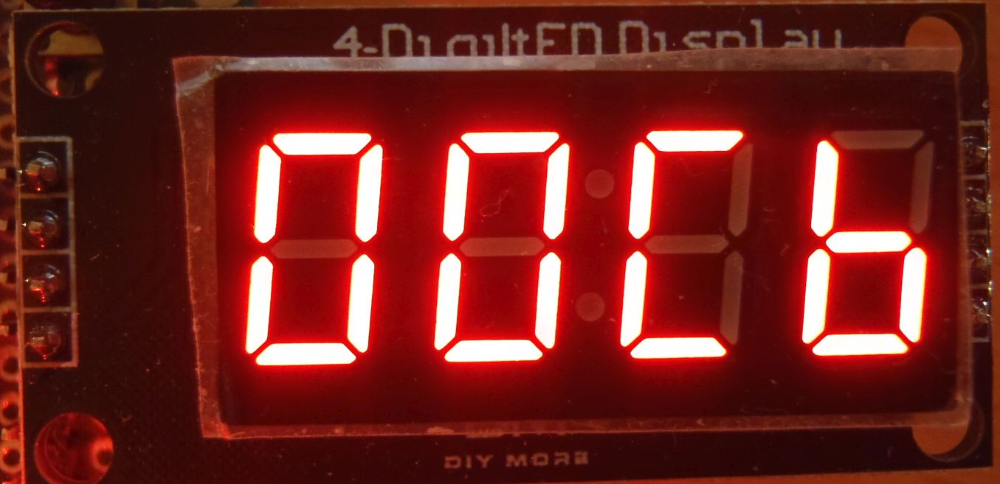
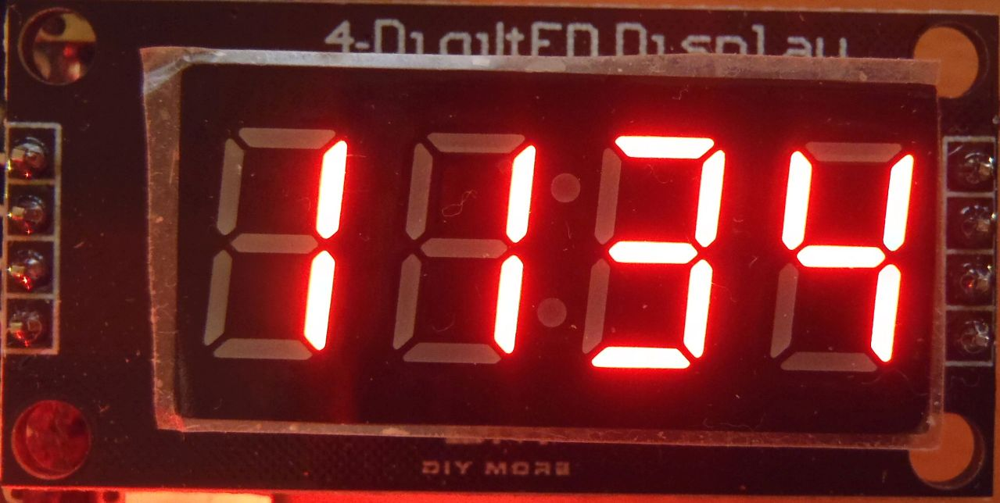
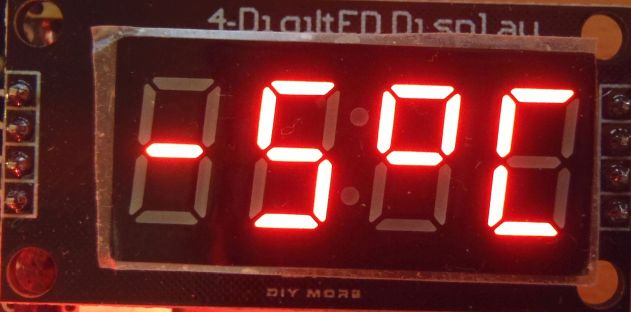
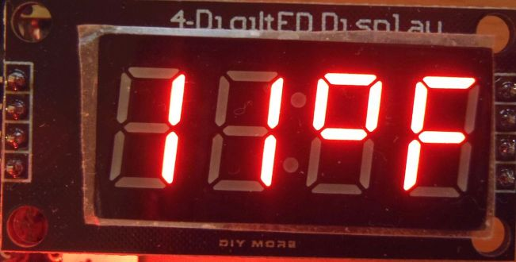
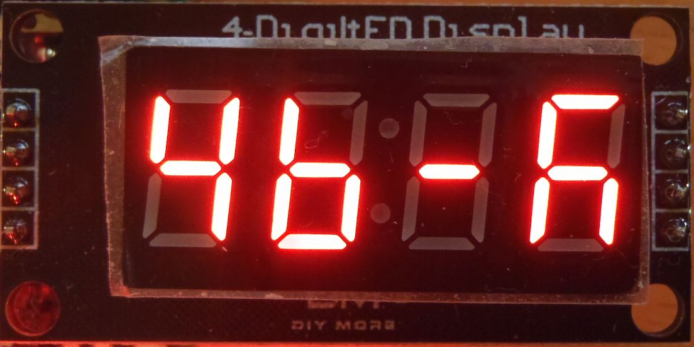
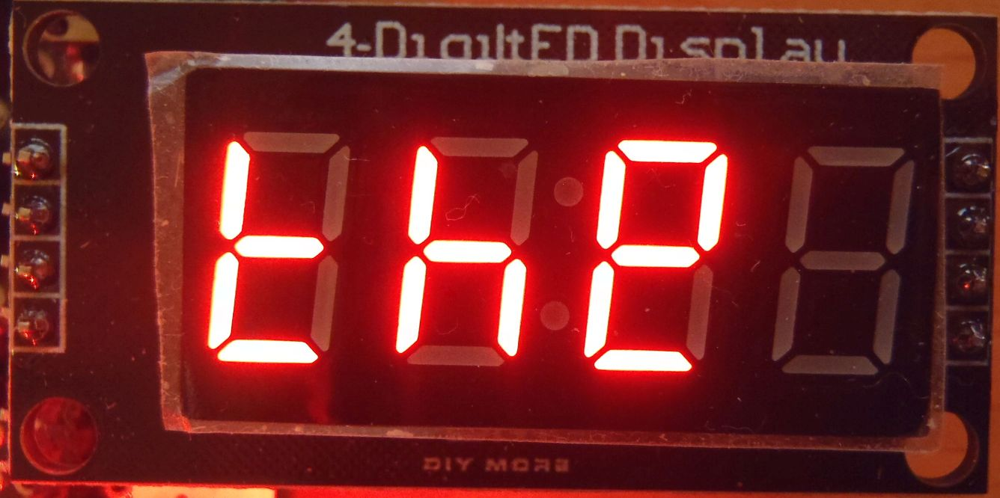
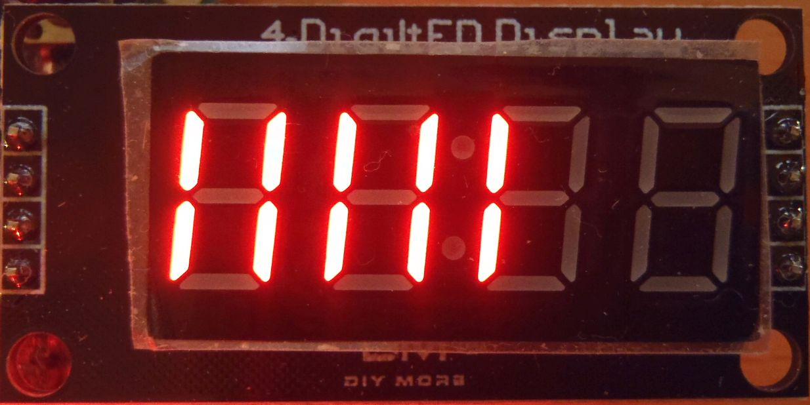

# AceSegment

[](https://github.com/bxparks/AceSegment/actions/workflows/aunit_tests.yml)

An adjustable, configurable, and extensible framework for rendering seven
segment LED displays on Arduino platforms. The library supports multiple types
of LED displays:

* LED modules using the TM1637 controller chip over a custom 2 wire protocol
* LED modules using the MAX7219/MAX7221 controller chip over SPI
* LED modules using the HT16K33 controller chip over I2C
* LED modules using two 74HC595 shift register chips over SPI
* LED modules using a hybrid of one 74HC595 chip and direct GPIO connections
* LED modules directly connected to the GPIO pins, no controller chips

The first 4 types are readily available from consumer sources such as Amazon and
eBay, in multiple colors and sizes. The final 2 types of modules (hybrid and
directly connected) are usually custom creations. The AceSegment library hopes
to support as many of these configurations as possible within a single
framework.

Different types of seven-segment LED modules using different controller chips
are similar enough to each other that code at the application layer should be
mostly agnostic to the hardware differences. The AceSegment library is organized
into hardware-dependent components and hardware-independent components to allow
application code to be written without worrying too much about the low-level
details of the specific LED module.

**Version**: 0.6+ (2021-06-09)

**Changelog**: [CHANGELOG.md](CHANGELOG.md)

**Status**: This is a **work in progress**. It is not ready for public
consumption.

## Table of Contents

* [Installation](#Installation)
    * [Source Code](#SourceCode)
    * [Dependencies](#Dependencies)
* [Documentation](#Documentation)
    * [Examples](#Examples)
* [High Level Overview](#HighLevelOverview)
    * [Classes](#Classes)
    * [Dependency Diagram](#DependencyDiagram)
    * [Digit and Segment Addressing](#DigitAndSegmentAddressing)
* [Usage](#Usage)
    * [Include Header and Namespace](#HeaderAndNamespace)
    * [LedModule](#LedModule)
    * [Tm1637Module](#Tm1637Module)
        * [TM1637 Module With 4 Digits](#Tm1637Module4)
        * [TM1637 Module With 6 Digits](#Tm1637Module6)
        * [TM1637 Capacitor Removal](#Tm1637CapacitorRemoval)
    * [Max7219Module](#Max7219Module)
        * [MAX7219 Module With 8 Digits](#Max7219Module8)
    * [Ht16k33Module](#Ht16k33Module)
        * [HT16K33 Module With 4 Digits](#Ht16k33Module4)
    * [Hc595Module](#Hc595Module)
        * [74HC595 Module With 8 Digits](#Hc595Module8)
        * [74HC595 Module With 4 Digits](#Hc595Module4)
        * [Rendering the Hc595Module](#RenderingHc595Module)
    * [HybridModule](#HybridModule)
    * [DirectModule](#DirectModule)
    * [LedDisplay](#LedDisplay)
    * [NumberWriter](#NumberWriter)
    * [ClockWriter](#ClockWriter)
    * [TemperatureWriter](#TemperatureWriter)
    * [CharWriter](#CharWriter)
    * [StringWriter](#StringWriter)
    * [LevelWriter](#LevelWriter)
    * [StringScroller](#StringScroller)
* [Advanced Usage](#AdvancedUsage)
    * [DigitalWriteFast on AVR](#DigitalWriteFast)
    * [Multiple SPI Buses](#MultipleSpiBuses)
    * [ScanningModule](#ScanningModule)
* [Resource Consumption](#ResourceConsumption)
    * [SizeOf Classes](#SizeOfClasses)
    * [Flash And Static Memory](#FlashAndStaticMemory)
    * [CPU Cycles](#CpuCycles)
* [System Requirements](#SystemRequirements)
    * [Hardware](#Hardware)
    * [Tool Chain](#ToolChain)
    * [Operating System](#OperatingSystem)
* [Bugs And Limitations](#BugsAndLimitations)
* [License](#License)
* [Feedback and Support](#FeedbackAndSupport)
* [Authors](#Authors)

<a name="Installation"></a>
## Installation

The latest stable release will eventually be available in the Arduino IDE
Library Manager. Search for "AceSegment". Click install. (It is not there
yet.)

The development version can be installed by cloning the
[GitHub repository](https://github.com/bxparks/AceSegment), checking out the
`develop` branch, then manually copying over the contents to the `./libraries`
directory used by the Arduino IDE. (The result is a directory named
`./libraries/AceSegment`.)

The `master` branch contains the stable release.

<a name="SourceCode"></a>
### Source Code

The source files are organized as follows:
* `src/AceSegment.h` - main header file
* `src/ace_segment/` - implementation files
* `src/ace_segment/testing/` - internal testing files
* `tests/` - unit tests which require [AUnit](https://github.com/bxparks/AUnit)
* `examples/` - example sketches
* `docs/` - contains the doxygen docs and additional manual docs

<a name="Dependencies"></a>
### Dependencies

This library depends on the following additional libraries:

* AceCommon (https://github.com/bxparks/AceCommon)

The unit tests depend on:

* AUnit (https://github.com/bxparks/AUnit)

Some of the examples may depend on:

* AceButton (https://github.com/bxparks/AceButton)
* TimerOne (https://github.com/PaulStoffregen/TimerOne)
* one of the DigitalWriteFast libraries
    * https://github.com/watterott/Arduino-Libs/tree/master/digitalWriteFast
    * https://github.com/NicksonYap/digitalWriteFast

<a name="Documentation"></a>
## Documentation

* this `README.md` file
* [scanning_module.md](docs/scanning_module.md)
    * ScanningModule usage
* [capacitor_removal.md](docs/tm1637/capacitor_removal.md)
    * Removing the 10 nF capacitors on certain TM1637 LED modules
* [Doxygen docs](https://bxparks.github.io/AceSegment/html)
    * On Github pages.

<a name="Examples"></a>
### Examples

The following example sketches are provided:

* Basic
    * [Tm1637Demo.ino](examples/Tm1637Demo)
        * Demo of a TM1637 LED module using `Tm1637Module`
    * [Max7219Demo.ino](examples/Max7219Demo)
        * Demo of a MAX7219 LED module using `Max7219Module`
    * [Ht16k33Demo.ino](examples/Ht16k33Demo)
        * Demo of a HT16K33 LED module using `Ht16k33Module`
    * [Hc595Demo.ino](examples/Hc595Demo)
        * Demo of a 74HC595 LED module using `Hc595Module`
    * [AceSegmentTester.ino](examples/AceSegmentTester)
        * demo-reel through most of the features of the library
        * uses 2 buttons for "single step" debugging mode
        * depends on AceButton (https://github.com/bxparks/AceButton) library
* Advanced
    * [DirectDemo.ino](examples/DirectDemo)
        * Demo of an LED module with no controller, all digit and segment pins
          wired directly to the microcontroller
        * Uses `DirectModule` class
    * [DirectFast4Demo.ino](examples/DirectFast4Demo)
        * same as `DirectDemo` but using `DirectFast4Module` which uses
          `digitalWriteFast()`
    * [HybridDemo.ino](examples/HybridDemo)
        * Demo of an LED module that uses a single 74HC595 shift register on the
          segment pins, but the digit pins are wired directly to the
          microcontroller
        * Uses `HybridModule` class
    * [Tm1637DualDemo.ino](examples/Tm1637DualDemo)
        * render two TM1637 LED modules at the same time using two
          `Tm1637Module` instances
    * [ModulatingDemo.ino](examples/ModulatingDemo)
        * demo of brightness control on a per-digit basis using `DirectModule`,
          `HybridModule`, or `Hc595Module`
    * [ScanningDemo.ino](examples/ScanningDemo)
        * Low-level demo `ScanningModule` combined with various
          `LedMatrixDirect`, `LedMatrixSingleHc595` and `LedMatrixDualHc595`
          classes
        * Not intended for general public consumption.
    * [Hc595InterruptDemo.ino](examples/Hc595InterruptDemo)
        * Same as Hc595Demo, but using an interrupt service routine (ISR)
          to render the LED display.
        * Uses the `TimerOne` (https://github.com/PaulStoffregen/TimerOne)
          library
* Benchmarks
    * [AutoBenchmark.ino](examples/AutoBenchmark): performs CPU benchmarking of
      most of the supported configurations of the framework
    * [MemoryBenchmark.ino](examples/MemoryBenchmark): determines the size of
      the various components of the library

<a name="HighLevelOverview"></a>
## High Level Overview

<a name="Classes"></a>
### Classes

Here are the classes in the library which will be most useful to the
end-users, listed roughly from low-level to higher-level classes which often
depend on the lower-level classes:

* `SpiInterface`
    * Thin wrapper classes for communicating with LED modules that support SPI
    * Used by `Max7219Module` and `Hc595Module`.
    * There are 4 implementations.
        * `SoftSpiInterface`
            * Software SPI using `shiftOut()`
        * `SoftSpiFastInterface`
            * Software SPI using `digitalWriteFast()` on AVR processors
        * `HardSpiInterface`
            * Hardware SPI using `digitalWrite()` to control the latch pin.
        * `HardSpiFastInterface`
            * Hardware SPI using `digitalWriteFast()` to control the latch pin.
* `TmiInterface`
    * Thin wrapper classes to communicating with LED modules using the TM1637
      protocol. Similar to I2C but not exactly the same.
    * Used by `Tm1637Module`.
    * There are 2 implementations:
        * `SoftTmiInterface`
            * Implement the TM1637 protocol using `digitalWrite()`.
        * `SoftTmiFastInterface`
            * Implement the TM1637 protocol using `digitalWriteFast()`.
* `WireInterface`
    * Thin wrapper classes for communicating with LED modules using I2C.
    * Used by `Ht16k33Module`.
    * There are 2 implementations:
        * `HardWireInterface`
        * `SimpleWireInterface`
* `LedModule`
    * Base interface for all hardware dependent implementation of a
      seven-segment LED module.
    * `Tm1637Module`
        * An implementation using a TM1637 controller.
    * `Max7219Module`
        * An implementation using a MAX7219 controller.
    * `Ht16k33Module`
        * An implementation using an HT16K33 controller.
    * `Hc595Module`
        * An implementation using two 74HC595 shift registers.
    * `HybridModule`
        * An implementation using one 74HC595 shift registers
          to handle the 8 segment lines, with the digit lines directly connected
          to the GPIO pins of the micrcontroller.
    * `DirectModule`
        * An implementation with all segment and digit pins connected directly
          to the microcontroller.
* `LedDisplay`
    * Class that knows how to write segment bit patterns to an `LedModule`.
    * Provides a single, common API to the various Writer classes.
* Writers
    * Helper classes built on top of the `LedDisplay` which provide higher-level
      interface to the LED module, such as printing numbers, time (hh:mm),
      and ASCII characters and strings.
    * `NumberWriter`
        * A class that writes integers in decimal or hexadecimal format to the
          `LedDisplay`.
        * A few additional characters are supported: `kCharSpace`, `kCharMinus`
    * `ClockWriter`
        * A class that writes a clock string "hh:mm" to `LedDisplay`.
        * A few additional symbols are supported: `kCharSpace`, `kCharMinus` and
          `kPatternA` ("A" for AM) and `kPatternP` ("P" for PM).
    * `TemperatureWriter`
        * A class that writes temperatures with a degrees symbol or optionally
          with "C" or "F" symbol.
    * `CharWriter`
        * A class that convert an ASCII character represented by a `char` (code
          0-127) to a bit pattern used by `SegmentDriver` class.
        * Not all ASCII characters can be rendered on a seven segment display
          legibly but the `CharWriter` tries its best.
    * `StringWriter`
        * A class that prints strings of `char` to a `CharWriter`, which in
          turns, prints to the `LedDisplay`.
    * `StringScoller`
        * Scroll a string left and right.
    * `LevelWriter`
        * Display specified number of bars from left to right, 2 bars per digit.

<a name="DependencyDiagram"></a>
### Dependency Diagram

The dependency diagram among these classes looks something like this
(simplified for ease of understanding):

```
   StringScroller
   StringWriter    ClockWriter TemperatureWriter
          |            \           /
          V             v         v
       CharWriter       NumberWriter     LevelWriter
            \              |             /
             --------      |     --------
                     \     |    /
                      v    v   v
                      LedDisplay
                          |            (hardware independent)
--------------------------|-------------------------------------
                          |            (hardware dependent)
                          v
                       LedModule
                          ^
                          |
      +-----------+-------+-----+--------------+--------------+---------+
      |           |             |              |              |         |
Tm1637Module  Max7219Module Hc595Module HybridModule DirectModule Ht16k33Module
      |               \         |       /                               |
      |                \        |      /                                |
      v                 v       v     v                                 v
SoftTmiInterface         SoftSpiInterface                     HardWireInterface
SoftTmiFastInterface     SoftSpiFastInterface               SimpleWireInterface
                         HardSpiInterface
                         HardSpiFastInterface
```

<a name="DigitAndSegmentAddressing"></a>
### Digit and Segment Addressing

The `LedModule` and `LedDisplay` classes use the following conventions for
addressing the digits and segments:

* digits start at position 0 on the left and increase to the right
* segments are assigned bits 0 to 7 of an unsigned byte (type `uint8_t`) with
  segment `a` assigned to bit 0, segment `g` assigned to bit 6, and the optional
  decimal point assigned to bit 7

```
+------------+  +------------+           +------------+
|   aaaa     |  |   aaaa     |           |   aaaa     |
|  f    b    |  |  f    b    |           |  f    b    |
|  f    b    |  |  f    b    |           |  f    b    |
|   gggg     |  |   gggg     |  *  *  *  |   gggg     |
|  e    c    |  |  e    c    |           |  e    c    |
|  e    c    |  |  e    c    |           |  e    c    |
|   dddd  dp |  |   dddd  dp |           |   dddd  dp |
+------------+  +------------+           +------------+
  Digit 0         Digit 1                 Digit {N-1}


Segment: dp g f e d c b a
   Bit:  7  6 5 4 3 2 1 0
```

Some 4-digit LED modules are designed to be used in a clock to display the hour
and minute components of the time as `HH:MM`. In these modules, it is common for
the decimal point on Digit 1 to be replaced with the `colon` segment between
Digit 1 and Digit 2. In these modules, sometimes the decimal points for the
other digits work normally, but sometimes, the remaining decimal points do not
work at all.

Sometimes the LED modules are hardwired to the controller chip so that the
positions of the digits (and sometimes segments) do not not match the logical
arrangement described above. Fortunately, we can rearrange the digit and segment
bits in software so that everything is remapped to their correct places. For
example, the diymore.cc 6-digit TM1637 LED module is wired so that the digits
are displayed like this:

```
2 1 0 5 4 3
```

The `Tm1637Module` class can remap these digits into their correct order:

```
0 1 2 3 4 5
```

Since it is impossible to predict all the different ways that the LED modules
can be wired, various classes in the AceSegment library allow the remapping
array to be supplied by the library user.

<a name="Usage"></a>
## Usage

<a name="HeaderAndNamespace"></a>
### Include Header and Namespace

Only a single header file `AceSegment.h` is required to use this library.
To prevent name clashes with other libraries that the calling code may use, all
classes are defined in the `ace_segment` namespace. To use the code without
prepending the `ace_segment::` prefix, use the `using` directive:

```C++
#include <AceSegment.h>
using namespace ace_segment;
```

<a name="LedModule"></a>
### LedModule

The `LedModule` class is the general interface (with mostly pure virtual
functions) which is the parent class of all hardware-dependent classes which are
targeted for specific controller chips. It looks like this:

```C++
class LedModule {
  public:
    explicit LedModule(uint8_t numDigits);

    uint8_t getNumDigits() const;
    virtual void setPatternAt(uint8_t pos, uint8_t pattern) = 0;
    virtual uint8_t getPatternAt(uint8_t pos) = 0;
    virtual void setBrightness(uint8_t brightness) = 0;
};
```

It assumes that each subclass has an internal buffer of bit patterns which
will be sent out to the LED module at the appropriate time. Some LED controllers
(e.g. TM1637, MAX7219) handle the multiplexing and refreshing of the LED
segments, so the host microcontroller needs only to send out the bit patterns to
the controller chips over SPI or some other protocol. Other controller chips,
particularly the 74HC595, is a fairly dumb controller chip that requires the
host microcontroller to perform the multiplexing itself. The bit patterns must
be sent out to the controller chip with precise timing intervals.

Because each controller chip has slightly different rendering requirements, the
`LedModule` class pushes the rendering logic down into the specific subclasses.

<a name="Tm1637Module"></a>
### Tm1637Module

LED modules based on the Titan TM1637 controller chips are abundant on Amazon
and eBay. The controller chip supports up to 6 digits. Consumer LED modules
seem have either 4 digits or 6 digits.

The `Tm1637Module` class looks like this:

```C++
template <typename T_TMII, uint8_t T_DIGITS>
class Tm1637Module : public LedModule {
  public:
    explicit Tm1637Module(
        const T_TMII& tmiInterface,
        const uint8_t* remapArray = nullptr
    );

    void begin();
    void end();

    uint8_t getNumDigits() const { return T_DIGITS; }
    void setPatternAt(uint8_t pos, uint8_t pattern) override;
    uint8_t getPatternAt(uint8_t pos) override;
    void setBrightness(uint8_t brightness) override;

    void setDisplayOn(bool on = true);

    void flush();
    void flushIncremental();
};
```

The `T_TMII` template parameter is a class that implements the 2-wire protocol
used by the TM1637 controller. It is a protocol that is very close to, but not
quite the same as, I2C. This means that we cannot use the usual `Wire` library,
but must implement a custom version. The library provides 2 implementations: the
`SoftTmiInterface` compatible with all platforms, and `SoftTmiFastInterface`
useful on AVR processors.

The `tmiInterface` is an instance of `T_TMII`, which is either
`SoftTmiInterface` or `SoftTmiFastInterface`.

The `remapArray` is an array of addresses which map the physical positions to
their logical positions. This is not needed by the 4-digit TM1637 LED modules,
but the 6-digit TM1637 LED modules commonly available on Amazon or eBay are
wired so that the digits need remapping.

Most of the methods of the class are inherited from the `LedModule`.

The `setDisplayOn()` method exposes the feature of the TM1637 chip where the
display can be turned on and off independent of the brightness. When the display
is turned back on, it resumes the previous brightness.

The `flush()` method sends all digits and the brightness information to the
TM1637 chip in a single transmission. The total amount of time needed to
complete the `flush()` method is mostly dependent on the value of the
`BIT_DELAY` parameter.

Some TM1637 LED modules requires a large `BIT_DELAY` value as high as 100
microseconds, which causes `flush()` to take about about 22 millis. For 6
digits, this method takes about 27 millis. The `flush()` method is a blocking
call, nothing else can be done during this time (outside of interrupts). This
can be a problem for processors like the ESP8266 which must yield back to the
main loop every 20-40 milliseconds to keep its WiFi stack working. Otherwise,
the watch dog timer performs a system reboot.

The `flushIncremental()` method was created to reduce the amount of time spent
in the blocking call to `flush()`. This method sends only a single digit for
each iteration. The next time `flushIncremental()` is called, it sends the next
digit to the LED module. After all the digits are sent, one more iteration sends
the brightness information to the module. So the total number of iteration to
update the entire LED module is `NUM_DIGITS + 1`. For `BIT_DELAY` of 100
microseconds, `flushIncremental()` takes around 10 milliseconds per iteration.

<a name="Tm1637Module4"></a>
#### TM1637 Module With 4 Digits


The configuration of the `Tm1637Module` class for the 4-digit module looks like
this (c.f. [examples/Tm1637Demo](examples/Tm1637Demo)):

```C++
#include <AceSegment.h>
using namespace ace_segment;

const uint8_t CLK_PIN = 10;
const uint8_t DIO_PIN = 9;
const uint16_t BIT_DELAY = 100;
const uint8_t NUM_DIGITS = 4;

using TmiInterface = SoftTmiInterface;
TmiInterface tmiInterface(CLK_PIN, DIO_PIN, BIT_DELAY);
Tm1637Module<TmiInterface, NUM_DIGITS> ledModule(tmiInterface);

LedDisplay display(ledModule);

void setupAceSegment() {
  tmiInterface.begin();
  ledModule.begin();
}

// Flush to LED module every 20 millis.
void flushModule() {
  static uint16_t prevFlushMillis;

  uint16_t nowMillis = millis();
  if ((uint16_t) (nowMillis - prevFlushMillis) >= 20) {
    prevFlushMillis = nowMillis;
    //ledModule.flush();
    ledModule.flushIncremental();
  }
}

void setup() {
  setupAceSegment();
  ...
}

void loop() {
  flushModule();
  ...
}
```

The `BIT_DELAY` parameter above is the number of microseconds to wait between
each bit transition (0 to 1, or 1 to 0). According the datasheet of the TM1637
chip, it can support oscillator frequencies as high as 500 kHz, which means that
theoretically, the `BIT_DELAY` could be as low as 1 microseconds.

The black LED modules manufactured by diymore.cc (shown above)
contains a 10 nF capacitor and a 10k ohm pullup resistor on each of the `DIO`
and `CLK` lines. This requires a `BIT_DELAY` of 100 microseconds.

The blue LED modules (shown above) seem to use much smaller filtering
capacitors. These modules seem to work with a `BIT_DELAY` of 7 microseconds.

<a name="Tm1637Module6"></a>
#### TM1637 Module With 6 Digits


The configuration of the `Tm1637Module` class for the 6-digit module is slightly
more complicated because the digits are wired to be in the order of `2 1 0 5 4
3`. A predefined remap array `kDigitRemapArray6Tm1637` must be given to the
`Tm1637Module` constructor, like this
(c.f. [examples/Tm1637Demo](examples/Tm1637Demo)):

```C++
#include <Arduino.h>
#include <AceSegment.h>
using namespace ace_segment;

const uint8_t CLK_PIN = 10;
const uint8_t DIO_PIN = 9;
const uint16_t BIT_DELAY = 100;
const uint8_t NUM_DIGITS = 4;

using TmiInterface = SoftTmiInterface;
TmiInterface tmiInterface(CLK_PIN, DIO_PIN, BIT_DELAY);
Tm1637Module<TmiInterface, NUM_DIGITS> ledModule(
    tmiInterface, kDigitRemapArray6Tm1637);

LedDisplay display(ledModule);

void setupAceSegment() {
  tmiInterface.begin();
  ledModule.begin();
}

// Flush to LED module every 20 millis.
void flushModule() {
  static uint16_t prevFlushMillis;
  uint16_t nowMillis = millis();
  if ((uint16_t) (nowMillis - prevFlushMillis) >= 20) {
    prevFlushMillis = nowMillis;
    //ledModule.flush();
    ledModule.flushIncremental();
  }
}

void setup() {
  setupAceSegment();
  ...
}

void loop() {
  flushModule();
  ...
}
```

<a name="Tm1637CapacitorRemoval"></a>
#### TM1637 Capacitor Removal

The black TM1637 LED modules from diymore.cc come with 10 nF filtering
capacitors on the `CLK` and `DIO` lines. This forces us to use a `BIT_DELAY` of
100 microseconds, which means that `flush()` on a 4-digit module takes 22
milliseconds. We can do far better by removing those filtering capacitors with a
soldering iron:

* See [docs/tm1637/capacitor_removal.md](docs/tm1637/capacitor_removal.md) for
  information on how to remove the 10 nF capacitors.

After removing them, I verified that these TM1637 LED modules will work with a
`BIT_DELAY` as low 1 microseconds (sometimes even a 0 microsecond delay will
work). The transmission time for `flush()` becomes proportionally faster. For
example, using 5 microsecond `BIT_DELAY` allows `flush()` to take only 1 to 2.3
milliseconds instead of 22 milliseconds.

<a name="Max7219Module"></a>
### Max7219Module

These LED modules use the MAX7219 controller chip which communicate using SPI. A
single chip supports 8 segments of up to 8 digits. Multiple controller chips can
be daisychained to support more than 8 digits. LED modules with 8 digits are
readily available from multiple suppliers on Amazon and eBay, and they look like
this:


The `Max7219Module` class looks like this:

```C++
template <typename T_SPII, uint8_t T_DIGITS>
class Max7219Module : public LedModule {
  public:
    explicit Max7219Module(
        const T_SPII& spiInterface,
        const uint8_t* remapArray = nullptr
    );

    void begin();
    void end();

    uint8_t getNumDigits() const { return T_DIGITS; }
    void setPatternAt(uint8_t pos, uint8_t pattern) override;
    uint8_t getPatternAt(uint8_t pos) override;
    void setBrightness(uint8_t brightness) override;

    void flush();
};
```

The `T_SPII` template parameter is one of the SPI interface classes. The library
provides 4 implementations: `SoftSpiInterface`, `SoftSpiFastInterface` (on AVR),
`HardSpiInterface` and `HardSpiFastInterface` (on AVR).

The `T_DIGITS` is the number of digits in the LED module. Since this is a
compile-time constant, the `Hc595Module` class uses it to allocate a buffer of 8
bytes to hold the LED segment bit patterns. This allocation is done at
compile-time.

Most of the methods of the class are implementations of the virtual methods in
the parent `LedModule` class.

The `flush()` method sends the bit patterns to the MAX7219 controller using SPI.

<a name="Max7219Module8"></a>
#### MAX7219 Module with 8 Digits

The configuration of the `Max7219Module` class for the 8-digit module looks like
this (c.f. [examples/Max7219Demo](examples/Max7219Demo)):

```C++
#include <Arduino.h>
#include <SPI.h>
#include <AceSegment.h>
using namespace ace_segment;

const uint8_t LATCH_PIN = 10;
const uint8_t DATA_PIN = MOSI;
const uint8_t CLOCK_PIN = SCK;
const uint8_t NUM_DIGITS = 8;

using SpiInterface = HardSpiInterface<SPIClass>;
SpiInterface spiInterface(SPI, LATCH_PIN);

Max7219Module<SpiInterface, NUM_DIGITS> ledModule(
    spiInterface, kDigitRemapArray8Max7219);
LedDisplay display(ledModule);

void setupAceSegment() {
  SPI.begin();
  spiInterface.begin();
  ledModule.begin();
}

// Flush to LED module every 100 millis.
void flushModule() {
  static uint16_t prevFlushMillis;
  uint16_t nowMillis = millis();
  if ((uint16_t) (nowMillis - prevFlushMillis) >= 100) {
    prevFlushMillis = nowMillis;
    ledModule.flush();
  }
}

void setup() {
  setupAceSegment();
  ...
}

void loop() {
  flushModule();
  ...
}
```

The 8-digit LED modules that seem to be readily available on Amazon and eBay
seem to have their digits wired in the opposite orientation compared to the one
used in this library. In other words, digit 0 is on the far right, and digit 7
is on the far left. The `kDigitRemapArray8Max7219` array tells the
`Max7219Module` class to remap those digits so that they appear correct.

<a name="Ht16k33Module"></a>
### Ht16k33Module

These LED modules use the HT16K33 controller chip which communicates using I2C.
A single chip supports up to 16 segments and 8 digits, but the AceSegment
library supports modules with only 8 segments (7 segments plus decimal point).
Generic 4-digit modules are readily available from multiple suppliers on Amazon
and eBay, and they look like this:


It was only after I purchased a set of these that I discovered that they seem to
be generic clones of the LED modules (https://www.adafruit.com/product/878)
available from [Adafruit](https://www.adafruit.com), such as these:


The `Ht16k33Module` class looks like this:

```C++
template <typename T_WIREI, uint8_t T_DIGITS>
class Ht16k33Module : public LedModule {
  public:
    explicit Ht16k33Module(T_WIREI& wire, bool enableColon = false);

    void enableColon(bool enable);
    void begin();
    void end();

    uint8_t getNumDigits() const { return T_DIGITS; }
    void setPatternAt(uint8_t pos, uint8_t pattern) override;
    uint8_t getPatternAt(uint8_t pos) override;
    void setBrightness(uint8_t brightness) override;

    void flush();
};
```

The `T_WIREI` template parameter is the class name of the Wire interface,
currently just `HardWireInterface`.

The `T_DIGITS` template parameter is the number of digits in the module. I have
only seen 4 digit modules for sale.

Most of the methods are implementations of the virtual methods of `LedModule`.

The `flush()` method sends all 4 digits as well as the brightness setting to the
LED module using I2C.

The `enableColon` parameter and the `enableColon()` method determine whether the
colon segment between Digit 1 and Digit 2 of the LED module is active. The
4-digit HT16K33 LED clock modules from Adafruit (and its clones) allow the colon
segment to be controlled independently of the decimal point of Digit 1. This is
unlike other 4-digit clock modules which take over the control line for the
decimal point of Digit 1 to the colon segment, causing that decimal point to
become disabled.

The AceSegment library does not support controlling both the decimal point and
the colon segment *at the time same*. However, it allows selecting one or the
other. With `enableColon = false`, the LED module behave like any other 4-digit
LED module with its decimal point on Digit 1. With `enableColon = true`, the LED
module behaves like a clock module with a colon segment between Digit 1 and
Digit 2. This behavior can be selected dynamically at runtime using the
`enableColon()` function.

<a name="Ht16k33Module4"></a>
#### HT16K33 Module with 4 Digits

The configuration of the `Ht16k33Module` class for the 4-digit Adfruit LED
module looks like this (c.f. [examples/Ht16k33Demo](examples/Ht16k33Demo)):

```C++
#include <Arduino.h>
#include <Wire.h>
#include <AceSegment.h>
using namespace ace_segment;

const uint8_t HT16K33_I2C_ADDRESS = 0x70;
const uint8_t SCL_PIN = SCL;
const uint8_t SDA_PIN = SDA;
const uint8_t NUM_DIGITS = 4;

using WireInterface = HardWireInterface<TwoWire>;
WireInterface wireInterface(Wire, HT16K33_I2C_ADDRESS);

Ht16k33Module<WireInterface, NUM_DIGITS> ledModule(wireInterface);
LedDisplay display(ledModule);

void setupAceSegment() {
  Wire.begin();
  wireInterface.begin();
  ledModule.begin();
}

// Flush to LED module every 100 millis.
void flushModule() {
  static uint16_t prevFlushMillis;
  uint16_t nowMillis = millis();
  if ((uint16_t) (nowMillis - prevFlushMillis) >= 100) {
    prevFlushMillis = nowMillis;
    ledModule.flush();
  }
}

void setup() {
  setupAceSegment();
  ...
}

void loop() {
  flushModule();
  ...
}
```

<a name="Hc595Module"></a>
### Hc595Module

The 74HC595 shift register is a well-known chip that can be used to control
seven-segment LED modules. Each chip converts 8 serial bits into 8 parallel pins
which can source or sink about 12 mA of current each. With two 74HC595 chips,
one chip can control the segment pins, the other can control the common digit
pins, and the two chips can be daisy chained together. The chips can be
programmed using the straightforward SPI protocol.

Recently (since about Aug 2020?), off-the-shelf 8-digit LED modules using two
74HC595 have become common on Amazon and eBay, in multiple colors. They look
like this:


The `Hc595Module` class looks roughly like this (simplified for ease of
understanding):

```C++
template <typename T_SPII, uint8_t T_DIGITS>
class Hc595Module : public ScanningModule<[snip]> {
  public:
    explicit Hc595Module(
        const T_SPII& spiInterface,
        uint8_t segmentOnPattern,
        uint8_t digitOnPattern,
        uint8_t framesPerSecond,
        uint8_t byteOrder,
        const uint8_t* remapArray = nullptr
    );

    void begin();
    void end();

    uint16_t getFramesPerSecond() const;
    uint16_t getFieldsPerSecond() const;
    uint16_t getFieldsPerFrame() const;

    uint8_t getNumDigits() const;
    void setPatternAt(uint8_t pos, uint8_t pattern) override;
    uint8_t getPatternAt(uint8_t pos) override;

    void setBrightness(uint8_t brightness) override;
    void setBrightnessAt(uint8_t pos, uint8_t brightness);

    bool renderFieldWhenReady();
    void renderFieldNow();
};
```

There are 2 template parameters. The `T_SPII` specifies the SPI interface which
will be used to communicate with the 74HC595 chips. There are 4 options:
`SoftSpiInterface`, `SoftSpiFastInterface` (on AVR), `HardSpiInterface` and
`HardSpiFastInterface` (on AVR).

The `T_DIGITS` is the number of digits in the LED module. Since this is a
compile-time constant, the `Hc595Module` class uses it to allocate a buffer of 8
bytes to hold the LED segment bit patterns. This allocation is done at
compile-time.

The `spiInstance` object is an instance of the `T_SPII` class.

The `segmentOnPattern` and `digitOnPattern` specify the bit patterns needed to
turn on the LED at the specified segment and digit. This is determine by the
polarity of the wiring of LED segments. The 8-digit LED modules from diymore.cc
seem to be using Common Anode LEDs, connected directly to the 74HC595 chips,
without driver transistors. That means that the segment pins are active low
(requires a 0 to turn sink current from the LEDs) and the digit pins are active
high (requires a 1 to send current into the LEDs). We can use the pre-defined
constants `kActiveLowPattern` and
`kActiveHighPattern` for these parameters.

The `framesPerSecond` is the desired refresh rate. A frame is one full rendering
of all digits in the LED display. A value of 60 is good enough for most people,
but some people can see flickering at this rate, so maybe 90 or 120 would be
better choices for those people. Higher frame rate means that
`renderFieldWhenReady()` or `renderFieldNow()` must be called faster.

With two 74HC595 shift registers daisy chained together, one of the 74HC595
controls the segments, and the other controls the digits. We send 16-bits to the
chips using SPI, and the `byteOrder` determines whether whether the digits pins
or segment pins are on the high byte. The library predefines 2 constants:
`ace_segment::kByteOrderSegmentHighDigitLow` and
`ace_segment::kByteOrderDigitHighSegmentLow` which specify this option.

The `remapArray` is optional in the general case, but for the 8-digit LED
modules  manufactured by diymore.cc, it seems to be required , because the 4
left-digits and 4 right-digits are swapped (appearing as "4 5 6 7 0 1 2 3"). The
library defines the `ace_segment::kDigitRemapArray8Hc595` array to remap these
digits to handle this LED module.

There are 2 rendering methods: `renderFieldNow()` and `renderFieldWhenReady()`.
See the section below for an explanation.

<a name="Hc595Module8"></a>
### 74HC595 Module With 8 Digits

The configuration of the `Hc595Module` class for the 8-digit module looks like
this (c.f. [examples/Hc595Demo](examples/Hc595Demo):

```C++
#include <Arduino.h>
#include <SPI.h>
#include <AceSegment.h>
using namespace ace_segment;

const uint8_t NUM_DIGITS = 8;
const uint8_t FRAMES_PER_SECOND = 60;

const uint8_t SEGMENT_ON_PATTERN = kActiveLowPattern;
const uint8_t DIGIT_ON_PATTERN = kActiveHighPattern;
const uint8_t HC595_BYTE_ORDER = kByteOrderSegmentHighDigitLow;
const uint8_t* const REMAP_ARRAY = kDigitRemapArray8Hc595;

const uint8_t LATCH_PIN = 10;
const uint8_t DATA_PIN = MOSI;
const uint8_t CLOCK_PIN = SCK;

using SpiInterface = HardSpiInterface<SPIClass>;
SpiInterface spiInterface(SPI, LATCH_PIN);

Hc595Module<SpiInterface, NUM_DIGITS> ledModule(
    spiInterface,
    SEGMENT_ON_PATTERN,
    DIGIT_ON_PATTERN,
    FRAMES_PER_SECOND,
    HC595_BYTE_ORDER,
    REMAP_ARRAY
);

LedDisplay display(ledModule);

void setupAceSegment() {
  SPI.begin();
  spiInterface.begin();
  ledModule.begin();
}

// Flush to LED module when ready. Call this as fast as possible, allowing
// the internal counters to figure out when to actually render.
void flushModule() {
  ledModule.renderFieldWhenReady();
}

void setup() {
  setupAceSegment();
  ...
}

void loop() {
  flushModule();
  ...
}
```

<a name="Hc595Module4"></a>
### 74HC595 Module With 4 Digits

Here is a custom LED module using two 74HC595 shift registers that I built a
couple of years ago:


The configuration of `Hc595Module` is very similar to the 8-digit module, except
for the following:

* The LED module is a Common Anode, so the digit pin needs to be `HIGH` and
  the segment pin needs to be `LOW`.
* There are 4 driver transistors on the digit lines which allows it handle
  higher currents. These cause the logic levels on the digit lines to be
  inverted. The digits are activated by `LOW` not `HIGH`, so `DIGIT_ON_PATTERN`
  is set to `kActiveLowPattern`.
* The two 74HC595 chips are wired so that the digit lines are in the upper 8
  bits, and the segment lines are in the lower 8 bits. Thus `HC595_BYTE_ORDER`
  must be set to `kByteOrderDigitHighSegmentLow`.
* The `REMAP_ARRAY` can be set to `nullptr` because the digits are arranged in
  the natural ordering expected by `Hc595Module`, left-most digit at position 0,
  and the right-most digit at position 3.

Putting all these together, we get the following code which is similar to the
8-digit version above, except for a few configuration parameters (c.f.
[examples/Hc595Demo](examples/Hc595Demo)):

```C++
#include <Arduino.h>
#include <SPI.h>
#include <AceSegment.h>
using namespace ace_segment;

const uint8_t NUM_DIGITS = 4;
const uint8_t FRAMES_PER_SECOND = 60;

const uint8_t SEGMENT_ON_PATTERN = kActiveLowPattern;
const uint8_t DIGIT_ON_PATTERN = kActiveLowPattern;
const uint8_t HC595_BYTE_ORDER = kByteOrderDigitHighSegmentLow;
const uint8_t* const REMAP_ARRAY = nullptr;

const uint8_t LATCH_PIN = 10;
const uint8_t DATA_PIN = MOSI;
const uint8_t CLOCK_PIN = SCK;

using SpiInterface = HardSpiInterface<SPIClass>;
SpiInterface spiInterface(SPI, LATCH_PIN);

Hc595Module<SpiInterface, NUM_DIGITS> ledModule(
    spiInterface,
    SEGMENT_ON_PATTERN,
    DIGIT_ON_PATTERN,
    FRAMES_PER_SECOND,
    HC595_BYTE_ORDER,
    REMAP_ARRAY
);

LedDisplay display(ledModule);

void setupAceSegment() {
  SPI.begin();
  spiInterface.begin();
  ledModule.begin();
}

// Flush to LED module when ready. Call this as fast as possible, allowing
// the internal counters to figure out when to actually render.
void flushModule() {
  ledModule.renderFieldWhenReady();
}

void setup() {
  setupAceSegment();
  ...
}

void loop() {
  flushModule();
  ...
}
```

<a name="RenderingHc595Module"></a>
#### Rendering the Hc595Module

Unlike the TM1637 and the MAX7219 chips, the 74HC595 does not automatically
multiplex through the digits of the LED module, giving the appearance that all
the digits are on at the same time. The scanning must be performed by the
microcontroller itself. The `Hc595Module::renderFieldWhenReady()` performs that
task. It should be called as quickly as possible, usually faster than `60 *
NUM_DIGITS` times per second, so for a 4-digit LED module, that's 240 times a
second, or every 5 milliseconds.

The rendering the LED module is split into 2 parts:

* a *frame* is one complete rendering of the LED display (4 digits),
* a *field* is a partial rendering of a single frame (a single digit).

A frame rate of about 60Hz will be sufficient to prevent obvious flickering of
the LED. For a 4-digit LED, that requires rendering 240 fields per second. The
`Hc595Module::renderFieldNow()` is meant to be used inside an interrupt service
routine (ISR) which is configured to execute exactly at the requested frequency.
It will immediately render the given field (a single digit) to the 74HC595 shift
registers. When it is called a second time, it will render the next digit. The
`Hc595Module::renderFieldWhenReady()` is designed to give an effective rendering
rate of 240 Hz using a polling method. It should be called as fast as possible
in the global `loop()` function. It keeps an internal timing variable that
remembers the last time that it was called. When the correct amount of time has
passed, it then calls `renderFieldNow()`, and resets the timing variable.

<a name="HybridModule"></a>
### HybridModule

Here is a 4-digit custom module that I built that uses one 74HC595 shift
register on the 8 segment lines (which can be accessed through 3 SPI pins), and
4 digit lines directly connected to the microcontroller.


This particular module has the following characteristics:

* Common Cathode leds, which means that the digit must be `LOW` and the segment
  must be `HIGH`.
* But there are 4 driver transistors on the digit lines, which inverts the logic
  levels, so the digits need to be `HIGH`.

The `HybridModule` configuration looks like this (c.f.
[examples/HybridDemo](examples/HybridDemo)):

```C++
#include <Arduino.h>
#include <SPI.h>
#include <AceSegment.h>
using namespace ace_segment;

const uint8_t NUM_DIGITS = 4;
const uint8_t FRAMES_PER_SECOND = 60;

const uint8_t DIGIT_PINS[NUM_DIGITS] = {4, 5, 6, 7};
const uint8_t LATCH_PIN = 10;
const uint8_t DATA_PIN = MOSI;
const uint8_t CLOCK_PIN = SCK;

using SpiInterface = HardSpiInterface<SPIClass>;
SpiInterface spiInterface(SPI, LATCH_PIN);

HybridModule<SpiInterface, NUM_DIGITS> ledModule(
    spiInterface,
    kActiveHighPattern /*segmentOnPattern*/,
    kActiveHighPattern /*digitOnPattern*/,
    FRAMES_PER_SECOND,
    DIGIT_PINS
);

LedDisplay display(ledModule);

void setupAceSegment() {
  SPI.begin();
  spiInterface.begin();
  ledModule.begin();
}

// Flush to LED module when ready. Call this as fast as possible, allowing
// the internal counters to figure out when to actually render.
void flushModule() {
  ledModule.renderFieldWhenReady();
}

void setup() {
  setupAceSegment();
  ...
}

void loop() {
  flushModule();
  ...
}
```

<a name="DirectModule"></a>
### DirectModule

Here is a custom 4-digit module that whose digit and segment lines are connected
directly to the microcontroller without any driver chip. This requires a
microcontroller with at least 12 GPIO pins.


This particular module has the following characteristics:

* Common Anode leds, which means that the digit must be `HIGH` and the segment
  must be `LOW`.
* But there are 4 driver transistors on the digit lines, which inverts the logic
  levels, so the digits need to be `LOW`.

The `DirectModule` configuration looks like this (c.f.
[examples/DirectDemo](examples/DirectDemo)):

```C++
#include <Arduino.h>
#include <AceSegment.h>
using namespace ace_segment;

const uint8_t NUM_DIGITS = 4;
const uint8_t NUM_SEGMENTS = 8;

const uint8_t DIGIT_PINS[NUM_DIGITS] = {4, 5, 6, 7};
const uint8_t SEGMENT_PINS[NUM_SEGMENTS] = {8, 9, 10, 16, 14, 18, 19, 15};

const uint8_t FRAMES_PER_SECOND = 60;

DirectModule<NUM_DIGITS, NUM_SUBFIELDS> ledModule(
    kActiveLowPattern /*segmentOnPattern*/,
    kActiveLowPattern /*digitOnPattern*/,
    FRAMES_PER_SECOND,
    SEGMENT_PINS,
    DIGIT_PINS);

LedDisplay display(ledModule);

void setupAceSegment() {
  ledModule.begin();
}

// Flush to LED module when ready. Call this as fast as possible, allowing
// the internal counters to figure out when to actually render.
void flushModule() {
  ledModule.renderFieldWhenReady();
}

void setup() {
  setupAceSegment();
  ...
}

void loop() {
  flushModule();
  ...
}
```

<a name="LedDisplay"></a>
### LedDisplay

The `LedDisplay` object is a thin-wrapper around an `LedModule` object which
provides a unified API to write bit patterns to the LED module at specific
positions. The `LedDisplay` also provides an API to set and clear the decimal
point on the LED module if available, and it provides the ability to control the
brightness of the LED module.

The public methods of class looks like this (not all public methods shown):

```C++
class LedDisplay {
  public:
    explicit LedDisplay(LedModule& ledModule);

    uint8_t getNumDigits() const;

    void writePatternAt(uint8_t pos, uint8_t pattern);
    void writePatternsAt(uint8_t pos, const uint8_t patterns[], uint8_t len);
    void writePatternsAt_P(uint8_t pos, const uint8_t patterns[], uint8_t len);
    void writeDecimalPointAt(uint8_t pos, bool state = true);

    void clear();
    void clearToEnd(uint8_t pos);

    void setBrightness(uint8_t brightness);
};
```

The decimal point is stored as bit 7 (the most significant bit) of the `uint8_t`
byte for a given digit. This bit is cleared by the other `writePatternAt()` or
`writePatternsAt()` functions. So the `writeDecimalPointAt()` should be called
**after** the other write methods are called.

The brightness value of an LED module is determine by the underlying controller
chip, and the range of values are different for each chip:

* The TM1637 chip supports 8 levels from 0 to 7, with 0 turning off the
  display and 7 being the brightest.
* The MAX7219 chip supports 16 levels from 0 to 15, with 0 being the dimmest
  level (which does not turn off the display), and 15 being the brightest.
* The brightness of 74HC595 module is controlled entirely by the
  microcontroller using pulse width modulation (PWM). The range of values could
  theoretically be from 0 to 255, but in practice, it is limited by the speed
  of the SPI protocol to the 74HC595 chip. A brightness range of 0-7 or 0-15
  seems practical for most configurations.

After a specific, hardware-dependent instance of `LedModule` is created, the
`LedDisplay` is created by wrapping around the `LedModule`:

```C++
LedDisplay display(ledModule);
```

Various Writer classes build upon the `LedDisplay` class to provide additional
ways of printing numbers and letters to the LED module.

<a name="NumberWriter"></a>
### NumberWriter

The `NumberWriter` can print integers to the `LedDisplay` using decimal (0-9) or
hexadecimal (0-9A-F) formats. On platforms that support it (AVR and ESP8266),
the bit mapping table is stored in flash memory to conserve static memory.

The public methods of this class looks something like this:

```C++
class NumberWriter {
  public:
    typedef uint8_t hexchar_t;
    static const hexchar_t kCharSpace = 0x10;
    static const hexchar_t kCharMinus = 0x11;

    explicit NumberWriter(LedDisplay& ledDisplay);

    LedDisplay& display();

    void writeHexCharAt(uint8_t pos, hexchar_t c);
    void writeHexCharsAt(uint8_t pos, hexchar_t [], uint8_t len);

    void writeHexByteAt(uint8_t pos, uint8_t b);
    void writeHexWordAt(uint8_t pos, uint16_t w);

    void writeUnsignedDecimalAt(uint8_t pos, uint16_t num, int8_t boxSize = 0);
    void writeSignedDecimalAt(uint8_t pos, int16_t num, int8_t boxSize = 0);
    void writeUnsignedDecimal2At(uint8_t pos, uint8_t num);

    void clearToEnd(uint8_t pos);
};
```

The `hexchar_t` type semantically represents the character set supported by this
class. It is implemented as an alias for `uint8_t`, which unfortunately means
that the C++ compiler will not warn about mixing this type with another
`uint8_t`. The range of this character set is from `[0,15]` plus 2 additional
symbols, so `[0,17]`:

* `NumberWriter::kCharSpace`
* `NumberWriter::kCharMinus`

A `NumberWriter` consumes about 150 bytes of flash memory on an AVR.





<a name="ClockWriter"></a>
### ClockWriter

There are special, 4 digit,  seven segment LED displays which replace the
decimal point with the colon symbol ":" between the 2 digits on either side so
that it can display a time in the format "hh:mm".

The public methods of this class look like this:

```C++
class ClockWriter {
  public:
    using hexchar_t = NumberWriter::hexchar_t;
    static const hexchar_t kCharSpace = NumberWriter::kCharSpace;
    static const hexchar_t kCharMinus = NumberWriter::kCharMinus;
    static const uint8_t kPatternA = 0b01110111;
    static const uint8_t kPatternP = 0b01110011;

    explicit ClockWriter(LedDisplay& ledDisplay, uint8_t colonDigit = 1);

    LedDisplay& display() const;
    void writeCharAt(uint8_t pos, hexchar_t c);
    void writeChar2At(uint8_t pos, hexchar_t c0, hexchar_t c1);

    void writeBcd2At(uint8_t pos, uint8_t bcd);
    void writeDec2At(uint8_t pos, uint8_t d);
    void writeDec4At(uint8_t pos, uint16_t dd);

    void writeHourMinute(uint8_t hh, uint8_t mm);
    void writeColon(bool state = true);
};
```

A `ClockWriter` consumes about 250 bytes of flash memory on an AVR, which
includes an instance of a `NumberWriter`.


<a name="TemperatureWriter"></a>
### TemperatureWriter

This class supports writing out temperatures in degrees Celsius or Fahrenheit.
The public methods of this class looks something like this:

```C++
class TemperatureWriter {
  public:
    static const uint8_t kPatternDegree = 0b01100011;
    static const uint8_t kPatternC = 0b00111001;
    static const uint8_t kPatternF = 0b01110001;

    explicit TemperatureWriter(LedDisplay& ledDisplay);

    LedDisplay& display();

    uint8_t writeTempAt(uint8_t pos, int16_t temp, boxSize = 0);
    uint8_t writeTempDegAt(uint8_t pos, int16_t temp, boxSize = 0);
    uint8_t writeTempDegCAt(uint8_t pos, int16_t temp, boxSize = 0);
    uint8_t writeTempDegFAt(uint8_t pos, int16_t temp, boxSize = 0);
};
```

A `TemperatureWriter` consumes about 270 bytes of flash memory on an AVR, which
includes an instance of a `NumberWriter`.





<a name="CharWriter"></a>
### CharWriter

It is possible to represent many of the ASCII characters in the range `[0,127]`
on a seven-segment LED display, although some of the characters will necessarily
be crude given the limited number of segments. The `CharWriter` contains a
[mapping of ASCII](https://github.com/dmadison/LED-Segment-ASCII) characters
to seven-segment bit patterns. On platforms that support it (AVR and
ESP8266), the bit pattern array is stored in flash memory to conserve static
memory.

The public methods of this class looks like this:

```C++
class CharWriter {
  public:
    static const uint8_t kCharPatterns[];
    static const uint8_t kNumChars = 128;

    explicit CharWriter(
        LedDisplay& ledDisplay,
        const uint8_t charPatterns[] = kCharPatterns,
        uint8_t numChars = kNumChars
    );

    LedDisplay& display();

    void writeCharAt(uint8_t pos, char c);

    uint8_t getNumChars() const;
    uint8_t getPattern(char c) const;
};
```

A `CharWriter` consumes about 250 bytes of flash memory on an AVR.



<a name="StringWriter"></a>
### StringWriter

A `StringWriter` is a class that builds on top of the `CharWriter`. It knows how
to write entirely strings into the LED display. The public methods look like:

```C++
class StringWriter {
  public:
    explicit StringWriter(CharWriter& charWriter);

    LedDisplay& display();

    uint8_t writeStringAt(uint8_t pos, const char* cs, uint8_t numChar = 255);

    uint8_t writeStringAt(uint8_t pos, const __FlashStringHelper* fs,
            uint8_t numChar = 255);

    void clearToEnd(uint8_t pos);
};
```

The implementation of `writeStringAt()` is straightforward except for the
handling of a decimal point. A seven segment LED digit contains a small LED for
the decimal point. Instead of taking up an entire digit for a single '.'
character, we can collapse the '.' character into the decimal point indicator of
the previous character on the left.

The optional `numChar` parameter limits the number of characters in the string
to write. The default value is 255 which is expected to be larger than the
largest LED module that will be used with AceSegment, so the default value will
print the entire string.

The actual number of LED digits written is returned by `writeStringAt()`. For
example, writing `"1.2"` returns 2 because the decimal point was merged into the
previous digit and only 2 digits are written.

The `clearToEnd()` method clears the LED display from the given `pos` to the end
of the display.

The following sequence of calls will write the given string and clear all digits
after the end of the string:

```C++
StringWriter stringWriter(ledDisplay);

uint8_t written = stringWriter.writeStringAt(0, s);
stringWriter.clearToEnd(written);
```



<a name="LevelWriter"></a>
### LevelWriter

A `LevelWriter` writes a specified number of vertical bars (2 vertical
bar per digit) to the LED display, emulating a level meter LED module.

```C++
class LevelWriter {
  public:
    explicit LevelWriter(LedDisplay& ledDisplay);

    LedDisplay& display() const;

    uint8_t getMaxLevel() const;
    void writeLevel(uint8_t level);
};
```



<a name="StringScroller"></a>
### StringScroller

A `StringScroller` is a class that builds on top of the `CharWriter`. It knows
how to write entirely strings into the LED display. The public methods look
like:

```C++
class StringScroller {
  public:
    explicit StringScroller(CharWriter& charWriter);

    LedDisplay& display() const;

    void initScrollLeft(const char* s);
    void initScrollLeft(const __FlashStringHelper* s);
    bool scrollLeft();

    void initScrollRight(const char* s);
    void initScrollRight(const __FlashStringHelper* s);
    bool scrollRight();
};
```

To scroll a string to the left, initialize the string using `initScrollLeft()`,
then call `scrollLeft()` to shift one position to the left. The string scrolls
into the first digit on the right. When the scrolling is finished, the display
becomes blank, and the `scrollLeft()` method returns `true` to indicate
`isDone`.

Similarly to scroll to the right, initialize the string using
`initScrollRight()`, then call `scrollRight()` to shift to the right. The string
scrolls into the first digit on the left. When the scrolling is finished, the
display becomes blank, and the `scrollRight()` method returns `true` to indicate
`isDone`.

<a name="AdvancedUsage"></a>
## Advanced Usage

<a name="DigitalWriteFast"></a>
### DigitalWriteFast on AVR Processors

On the AVR processors (e.g. Arduino Nano, SparkFun Pro Micro), the default
`digitalWrite()`, `digitalRead()` and `pinMode()` functions can be significantly
improved (up to 50X performance, and a lot less flash memory) if the pin number
and output value are known at compile-time. There are at least 2 libraries that
provide the `digitalWriteFast()` variants:

* https://github.com/watterott/Arduino-Libs/tree/master/digitalWriteFast, or
* https://github.com/NicksonYap/digitalWriteFast

I have written versions of some lower-level classes to take advantage of
`digitalWriteFast()`:

* `scanning/LedMatrixDirectFast4.h`
    * Variant of `LedMatrixDirect` using `digitalWriteFast()`
* `hw/SoftSpiFastInterface.h`
    * Variant of `SoftSpiInterface.h` using  `digitalWriteFast()` for the
      `MOSI`, `SCK` and `LATCH` pins
* `hw/HardSpiFastInterface.h`
    * Variant of `HardSpiInterface.h` using  `digitalWriteFast()` to toggle
      the `LATCH` pin, while the hardware SPI code controls the `MOSI` and `SCK`
      pins
* `hw/SoftTmiFastInterface.h`
    * Variant of `SoftTmiInterface.h` using `digitalWriteFast()`

Since these header files require an external `digitalWriteFast` library to be
installed, and they are only valid for AVR processors, these header files are
*not* included in the master `<AceSegment.h>` file. If you want to use them, you
need to include these headers manually, like this:

```C++
#include <AceSegment.h> // do this first
...

#if defined(ARDUINO_ARCH_AVR)
  #include <digitalWriteFast.h> // from 3rd party library
  #include <ace_segment/hw/SoftSpiFastInterface.h>
  #include <ace_segment/hw/HardSpiFastInterface.h>
  #include <ace_segment/hw/SoftTmiFastInterface.h>
  #include <ace_segment/direct/DirectFast4Module.h>
#endif
```

The amount of flash memory saved can be between 100 to 700 bytes. This can make
meaningful differences on AVR processors, especially on the ATtiny85 with only
8kB of flash. See [MemoryBenchmark](examples/MemoryBenchmark) for full details.

<a name="MultipleSpiBuses"></a>
### Multiple SPI Buses

Some processors (e.g. STM32, ESP32) have multiple hardware SPI buses. Here are
some notes about how to configure them.

#### STM32 (STM32F103)

The STM32F103 "Blue Pill" has 2 SPI buses:
* SPI1
    * SS1 = PA4
    * SCK1 = PA5
    * MISO1 = PA6
    * MOSI1 = PA7
* SPI2
    * SS2 = PB12
    * SCK2 = PB13
    * MISO2 = PB14
    * MOSI2 = PB15

The primary (default) SPI interface is used like this:

```C++
#include <Arduino.h>
#include <SPI.h>
#include <AceSegment.h>
using namespace ace_segment;

const uint8_t LATCH_PIN = SS;
const uint8_t DATA_PIN = MOSI;
const uint8_t CLOCK_PIN = SCK;

HardSpiInterface<SPIClass> spiInterface(SPI, LATCH_PIN);

Max7219Module<HardSpiInterface, NUM_DIGITS> max7219Module(
    spiInterface, kDigitRemapArray8Max7219);

void setupAceSegment() {
  SPI.begin();
  spiInterface.begin();
  max7219Module.begin();
}
```

The second SPI interface can be used like this:

```C++
#include <Arduino.h>
#include <SPI.h>
#include <AceSegment.h>
using namespace ace_segment;

const uint8_t LATCH_PIN = PB12;
const uint8_t DATA_PIN = PB15;
const uint8_t CLOCK_PIN = PB13;

SPIClass SPISecondary(DATA_PIN, PB14 /*miso*/, CLOCK_PIN);
HardSpiInterface<SPIClass> spiInterface(SPISecondary, LATCH_PIN);

Max7219Module<HardSpiInterface, NUM_DIGITS> max7219Module(
    spiInterface, kDigitRemapArray8Max7219);

void setupAceSegment() {
  SPISecondary.begin();
  spiInterface.begin();
  max7219Module.begin();
}
```

#### ESP32

The ESP32 has 4 SPI buses, of which 2 are available for general purposes. The
default GPIO pin mappings are:

* SPI2 (aka HSPI)
    * MOSI = 13
    * MISO = 12
    * SS = 15
    * SCK = 14
* SPI3 (aka VSPI, default)
    * MOSI = 23
    * MISO = 19
    * SS = 5
    * SCK = 18

(My understanding is that the ESP32 has some sort of GPIO pin remapping
matrix that can reroute these pins to other pins, but my knowledge of this
capability is limited.)

The primary (default) `SPI` instance uses the `VSPI` bus and is used like this:

```C++
#include <Arduino.h>
#include <SPI.h>
#include <AceSegment.h>
using namespace ace_segment;

const uint8_t LATCH_PIN = SS;
const uint8_t DATA_PIN = MOSI;
const uint8_t CLOCK_PIN = SCK;

HardSpiInterface<SPIClass> spiInterface(SPI, LATCH_PIN);

Hc595Module<HardSpiInterface, NUM_DIGITS> hc595Module(
    spiInterface,
    SEGMENT_ON_PATTERN,
    DIGIT_ON_PATTERN,
    FRAMES_PER_SECOND,
    HC595_BYTE_ORDER,
    REMAP_ARRAY
);

void setupAceSegment() {
  SPI.begin();
  spiInterface.begin();
  hc595Module.begin();
}
```

The secondary `HSPI` bus can be used like this:

```C++
#include <Arduino.h>
#include <SPI.h>
#include <AceSegment.h>
using namespace ace_segment;

const uint8_t LATCH_PIN = 15;
const uint8_t DATA_PIN = 13;
const uint8_t CLOCK_PIN = 14;

SPIClass SPISecondary(HSPI);
HardSpiInterface<SPIClass> spiInterface(SPISecondary, LATCH_PIN);

Hc595Module<HardSpiInterface, NUM_DIGITS> hc595Module(
    spiInterface,
    SEGMENT_ON_PATTERN,
    DIGIT_ON_PATTERN,
    FRAMES_PER_SECOND,
    HC595_BYTE_ORDER,
    REMAP_ARRAY
);

void setupAceSegment() {
  SPISecondary.begin();
  spiInterface.begin();
  hc595Module.begin();
}
```

<a name="ScanningModule"></a>
### Custom Configuration of ScanningModule

The 3 convenience classes (`DirectModule`, `HybridModule`, and `Hc595Module`)
are subclasses of the `ScanningModule` parent class. If you want to know how the
`ScanningModule` is implemented, there are some notes in
[docs/scanning_module.md](docs/scanning_module.md).

<a name="ResourceConsumption"></a>
## Resource Consumption

<a name="SizeOfClasses"></a>
### SizeOf Classes

Here are the sizes of the various classes on the 8-bit AVR microcontrollers
(Arduino Uno, Nano, etc):

```
sizeof(SoftTmiInterface): 4
sizeof(SoftTmiFastInterface<4, 5, 100>): 1
sizeof(SoftSpiInterface): 3
sizeof(SoftSpiFastInterface<11, 12, 13>): 1
sizeof(HardSpiInterface): 3
sizeof(HardSpiFastInterface): 2
sizeof(HardWireInterface): 3
sizeof(LedMatrixDirect<>): 9
sizeof(LedMatrixDirectFast4<6..13, 2..5>): 3
sizeof(LedMatrixSingleHc595<SoftSpiInterface>): 8
sizeof(LedMatrixDualHc595<HardSpiInterface>): 8
sizeof(LedModule): 3
sizeof(ScanningModule<LedMatrixBase, 4>): 22
sizeof(DirectModule<4>): 31
sizeof(DirectFast4Module<...>): 25
sizeof(HybridModule<SoftSpiInterface, 4>): 30
sizeof(Hc595Module<SoftSpiInterface, 8>): 46
sizeof(Tm1637Module<SoftTmiInterface, 4>): 14
sizeof(Tm1637Module<SoftTmiInterface, 6>): 16
sizeof(Max7219Module<SoftSpiInterface, 8>): 16
sizeof(Ht16k33Module<HardWireInterface, 4>): 11
sizeof(LedDisplay): 2
sizeof(NumberWriter): 2
sizeof(ClockWriter): 3
sizeof(TemperatureWriter): 2
sizeof(CharWriter): 5
sizeof(StringWriter): 2
sizeof(LevelWriter): 2
sizeof(StringScroller): 8
```

On 32-bit processors, these numbers look like this:

```
sizeof(SoftTmiInterface): 4
sizeof(SoftSpiInterface): 3
sizeof(HardSpiInterface): 8
sizeof(HardWireInterface): 8
sizeof(LedMatrixDirect<>): 16
sizeof(LedMatrixSingleHc595<SoftSpiInterface>): 16
sizeof(LedMatrixDualHc595<HardSpiInterface>): 16
sizeof(LedModule): 8
sizeof(ScanningModule<LedMatrixBase, 4>): 32
sizeof(DirectModule<4>): 48
sizeof(HybridModule<SoftSpiInterface, 4>): 48
sizeof(Hc595Module<SoftSpiInterface, 8>): 64
sizeof(Tm1637Module<SoftTmiInterface, 4>): 24
sizeof(Tm1637Module<SoftTmiInterface, 6>): 28
sizeof(Max7219Module<SoftSpiInterface, 8>): 28
sizeof(Ht16k33Module<HardWireInterface, 4>): 20
sizeof(LedDisplay): 4
sizeof(NumberWriter): 4
sizeof(ClockWriter): 8
sizeof(TemperatureWriter): 4
sizeof(CharWriter): 12
sizeof(StringWriter): 4
sizeof(LevelWriter): 4
sizeof(StringScroller): 12
```

<a name="FlashAndStaticMemory"></a>
### Flash And Static Memory

For the most part, the user pays only for the feature that is being used. For
example, if the `CharWriter` (which consumes 312 bytes of flash) is not used, it
is not loaded into the program.

The full details are given in
[examples/MemoryBenchmark](examples/MemoryBenchmark). Here are the flash and
static memory consumptions for various configurations on an Arduino Nano
(ATmega328):

```
+--------------------------------------------------------------+
| functionality                   |  flash/  ram |       delta |
|---------------------------------+--------------+-------------|
| baseline                        |    456/   11 |     0/    0 |
|---------------------------------+--------------+-------------|
| DirectModule                    |   1486/   64 |  1030/   53 |
| DirectFast4Module               |   1250/   94 |   794/   83 |
|---------------------------------+--------------+-------------|
| Hybrid(SoftSpi)                 |   1508/   58 |  1052/   47 |
| Hybrid(SoftSpiFast)             |   1400/   56 |   944/   45 |
| Hybrid(HardSpi)                 |   1556/   60 |  1100/   49 |
| Hybrid(HardSpiFast)             |   1506/   59 |  1050/   48 |
|---------------------------------+--------------+-------------|
| Hc595(SoftSpi)                  |   1486/   58 |  1030/   47 |
| Hc595(SoftSpiFast)              |   1076/   56 |   620/   45 |
| Hc595(HardSpi)                  |   1542/   60 |  1086/   49 |
| Hc595(HardSpiFast)              |   1474/   59 |  1018/   48 |
|---------------------------------+--------------+-------------|
| Tm1637(SoftTmi)                 |   1582/   39 |  1126/   28 |
| Tm1637(SoftTmiFast)             |    926/   36 |   470/   25 |
|---------------------------------+--------------+-------------|
| Max7219(SoftSpi)                |   1214/   44 |   758/   33 |
| Max7219(SoftSpiFast)            |    774/   42 |   318/   31 |
| Max7219(HardSpi)                |   1290/   46 |   834/   35 |
| Max7219(HardSpiFast)            |   1184/   45 |   728/   34 |
|---------------------------------+--------------+-------------|
| Ht16k33(HardWire)               |   2866/  251 |  2410/  240 |
|---------------------------------+--------------+-------------|
| StubModule+LedDisplay           |    578/   24 |   122/   13 |
| NumberWriter+Stub               |    682/   28 |   226/   17 |
| ClockWriter+Stub                |    766/   29 |   310/   18 |
| TemperatureWriter+Stub          |    764/   28 |   308/   17 |
| CharWriter+Stub                 |    788/   31 |   332/   20 |
| StringWriter+Stub               |    988/   39 |   532/   28 |
| StringScroller+Stub             |   1036/   45 |   580/   34 |
| LevelWriter+Stub                |    716/   28 |   260/   17 |
+--------------------------------------------------------------+
```

And here are the memory consumption numbers for an ESP8266:

```
+--------------------------------------------------------------+
| functionality                   |  flash/  ram |       delta |
|---------------------------------+--------------+-------------|
| baseline                        | 256700/26784 |     0/    0 |
|---------------------------------+--------------+-------------|
| DirectModule                    | 257784/27056 |  1084/  272 |
| DirectFast4Module               |     -1/   -1 |    -1/   -1 |
|---------------------------------+--------------+-------------|
| Hybrid(SoftSpi)                 | 257856/27056 |  1156/  272 |
| Hybrid(SoftSpiFast)             |     -1/   -1 |    -1/   -1 |
| Hybrid(HardSpi)                 | 258928/27072 |  2228/  288 |
| Hybrid(HardSpiFast)             |     -1/   -1 |    -1/   -1 |
|---------------------------------+--------------+-------------|
| Hc595(SoftSpi)                  | 257756/27060 |  1056/  276 |
| Hc595(SoftSpiFast)              |     -1/   -1 |    -1/   -1 |
| Hc595(HardSpi)                  | 258924/27068 |  2224/  284 |
| Hc595(HardSpiFast)              |     -1/   -1 |    -1/   -1 |
|---------------------------------+--------------+-------------|
| Tm1637(SoftTmi)                 | 257900/27028 |  1200/  244 |
| Tm1637(SoftTmiFast)             |     -1/   -1 |    -1/   -1 |
|---------------------------------+--------------+-------------|
| Max7219(SoftSpi)                | 257636/27028 |   936/  244 |
| Max7219(SoftSpiFast)            |     -1/   -1 |    -1/   -1 |
| Max7219(HardSpi)                | 258804/27044 |  2104/  260 |
| Max7219(HardSpiFast)            |     -1/   -1 |    -1/   -1 |
|---------------------------------+--------------+-------------|
| Ht16k33(HardWire)               | 261364/27500 |  4664/  716 |
|---------------------------------+--------------+-------------|
| StubModule+LedDisplay           | 256856/27004 |   156/  220 |
| NumberWriter+Stub               | 257352/27004 |   652/  220 |
| ClockWriter+Stub                | 257176/27012 |   476/  228 |
| TemperatureWriter+Stub          | 257464/27004 |   764/  220 |
| CharWriter+Stub                 | 257096/27012 |   396/  228 |
| StringWriter+Stub               | 257344/27020 |   644/  236 |
| StringScroller+Stub             | 257296/27028 |   596/  244 |
| LevelWriter+Stub                | 257000/27004 |   300/  220 |
+--------------------------------------------------------------+
```

<a name="CpuCycles"></a>
### CPU Cycles

The CPU benchmark numbers can be seen in
[examples/AutoBenchmark](examples/AutoBenchmark).

Here are the CPU numbers for an AVR processor:

```
+----------------------------------------+-------------------+---------+
| Functionality                          |   min/  avg/  max | samples |
|----------------------------------------+-------------------+---------|
| Direct(4)                              |    76/   82/   88 |      40 |
| Direct(4,subfields)                    |     4/   13/   84 |     640 |
| DirectFast4(4)                         |    28/   31/   40 |      40 |
| DirectFast4(4,subfields)               |     4/    8/   36 |     640 |
|----------------------------------------+-------------------+---------|
| Hybrid(4,SoftSpi)                      |   152/  161/  180 |      40 |
| Hybrid(4,SoftSpi,subfields)            |     4/   22/  180 |     640 |
| Hybrid(4,SoftSpiFast)                  |    28/   34/   44 |      40 |
| Hybrid(4,SoftSpiFast,subfields)        |     4/    8/   40 |     640 |
| Hybrid(4,HardSpi)                      |    36/   41/   52 |      40 |
| Hybrid(4,HardSpi,subfields)            |     4/    9/   48 |     640 |
| Hybrid(4,HardSpiFast)                  |    24/   28/   36 |      40 |
| Hybrid(4,HardSpiFast,subfields)        |     4/    7/   36 |     640 |
|----------------------------------------+-------------------+---------|
| Hc595(8,SoftSpi)                       |   268/  272/  300 |      80 |
| Hc595(8,SoftSpi,subfields)             |     4/   36/  300 |    1280 |
| Hc595(8,SoftSpiFast)                   |    24/   27/   36 |      80 |
| Hc595(8,SoftSpiFast,subfields)         |     4/    8/   32 |    1280 |
| Hc595(8,HardSpi)                       |    24/   30/   40 |      80 |
| Hc595(8,HardSpi,subfields)             |     4/    8/   36 |    1280 |
| Hc595(8,HardSpiFast)                   |    12/   17/   24 |      80 |
| Hc595(8,HardSpiFast,subfields)         |     4/    6/   24 |    1280 |
|----------------------------------------+-------------------+---------|
| Tm1637(4,SoftTmi)                      | 22316/22348/22564 |      10 |
| Tm1637(4,SoftTmi,incremental)          |  3612/ 8810/10304 |      50 |
| Tm1637(4,SoftTmiFast)                  | 21064/21092/21312 |      10 |
| Tm1637(4,SoftTmiFast,incremental)      |  3412/ 8314/ 9764 |      50 |
| Tm1637(6,SoftTmi)                      | 28060/28092/28336 |      10 |
| Tm1637(6,SoftTmi,incremental)          |  3612/ 9178/10304 |      70 |
| Tm1637(6,SoftTmiFast)                  | 26484/26512/26732 |      10 |
| Tm1637(6,SoftTmiFast,incremental)      |  3412/ 8663/ 9764 |      70 |
|----------------------------------------+-------------------+---------|
| Tm1637(4,SoftTmi,5us)                  |  2252/ 2283/ 2480 |      10 |
| Tm1637(4,SoftTmi,incremental,5us)      |   364/  897/ 1128 |      50 |
| Tm1637(4,SoftTmiFast,5us)              |  1000/ 1030/ 1104 |      10 |
| Tm1637(4,SoftTmiFast,incremental,5us)  |   164/  403/  508 |      50 |
|----------------------------------------+-------------------+---------|
| Max7219(8,SoftSpi)                     |  2380/ 2397/ 2624 |      20 |
| Max7219(8,SoftSpiFast)                 |   208/  217/  240 |      20 |
| Max7219(8,HardSpi)                     |   208/  221/  240 |      20 |
| Max7219(8,HardSpiFast)                 |   100/  107/  120 |      20 |
|----------------------------------------+-------------------+---------|
| Ht16k33(4,HardWire)                    |   336/  341/  356 |      20 |
+----------------------------------------+-------------------+---------+
```

What is amazing is that if you use `digitalWriteFast()`, the software SPI is
just as fast as hardware SPI, **and** consumes 500 bytes of less flash memory.

Here are the CPU numbers for an ESP8266:

```
+----------------------------------------+-------------------+---------+
| Functionality                          |   min/  avg/  max | samples |
|----------------------------------------+-------------------+---------|
| Direct(4)                              |    12/   13/   28 |      40 |
| Direct(4,subfields)                    |     0/    2/   24 |     640 |
|----------------------------------------+-------------------+---------|
| Hybrid(4,SoftSpi)                      |    29/   29/   45 |      40 |
| Hybrid(4,SoftSpi,subfields)            |     0/    4/   41 |     640 |
| Hybrid(4,HardSpi)                      |    12/   12/   28 |      40 |
| Hybrid(4,HardSpi,subfields)            |     0/    2/   20 |     640 |
|----------------------------------------+-------------------+---------|
| Hc595(8,SoftSpi)                       |    50/   50/   66 |      80 |
| Hc595(8,SoftSpi,subfields)             |     0/    6/   63 |    1280 |
| Hc595(8,HardSpi)                       |    14/   14/   30 |      80 |
| Hc595(8,HardSpi,subfields)             |     0/    2/   26 |    1280 |
|----------------------------------------+-------------------+---------|
| Tm1637(4,SoftTmi)                      | 21494/21502/21534 |      10 |
| Tm1637(4,SoftTmi,incremental)          |  3480/ 8477/ 9749 |      50 |
| Tm1637(6,SoftTmi)                      | 27022/27031/27044 |      10 |
| Tm1637(6,SoftTmi,incremental)          |  3481/ 8835/ 9784 |      70 |
|----------------------------------------+-------------------+---------|
| Tm1637(4,SoftTmi,5us)                  |  1523/ 1525/ 1532 |      10 |
| Tm1637(4,SoftTmi,incremental,5us)      |   247/  601/  693 |      50 |
|----------------------------------------+-------------------+---------|
| Max7219(8,SoftSpi)                     |   460/  461/  472 |      20 |
| Max7219(8,HardSpi)                     |   126/  126/  134 |      20 |
|----------------------------------------+-------------------+---------|
| Ht16k33(4,HardWire)                    |   245/  246/  272 |      20 |
+----------------------------------------+-------------------+---------+
```

On the ESP8266, the hardware SPI is about 4X faster, but it does consume 1200
bytes for flash space. But on the ESP8266 flash memory is usually not a concern,
so it seems to make sense to use hardware SPI on the ESP8266.

<a name="SystemRequirements"></a>
## System Requirements

<a name="Hardware"></a>
### Hardware

This library has Tier 1 support on the following boards:

* Arduino Nano (16 MHz ATmega328P)
* SparkFun Pro Micro (16 MHz ATmega32U4)
* SAMD21 M0 Mini (48 MHz ARM Cortex-M0+)
* STM32 Blue Pill (STM32F103C8, 72 MHz ARM Cortex-M3)
* NodeMCU 1.0 (ESP-12E module, 80MHz ESP8266)
* WeMos D1 Mini (ESP-12E module, 80 MHz ESP8266)
* ESP32 dev board (ESP-WROOM-32 module, 240 MHz dual core Tensilica LX6)
* Teensy 3.2 (72 MHz ARM Cortex-M4)

Tier 2 support can be expected on the following boards, mostly because I don't
test these as often:

* ATtiny85 (8 MHz ATtiny85)
* Arduino Pro Mini (16 MHz ATmega328P)
* Teensy LC (48 MHz ARM Cortex-M0+)
* Mini Mega 2560 (Arduino Mega 2560 compatible, 16 MHz ATmega2560)

The following boards are **not** supported:

* Any platform using the ArduinoCore-API
  (https://github.com/arduino/ArduinoCore-api).
    * For example, Nano Every, MKRZero, and Raspberry Pi Pico RP2040.

<a name="ToolChain"></a>
### Tool Chain

* [Arduino IDE 1.8.13](https://www.arduino.cc/en/Main/Software)
* [Arduino CLI 0.14.0](https://arduino.github.io/arduino-cli)
* [SpenceKonde ATTinyCore 1.5.2](https://github.com/SpenceKonde/ATTinyCore)
* [Arduino AVR Boards 1.8.3](https://github.com/arduino/ArduinoCore-avr)
* [Arduino SAMD Boards 1.8.9](https://github.com/arduino/ArduinoCore-samd)
* [SparkFun AVR Boards 1.1.13](https://github.com/sparkfun/Arduino_Boards)
* [SparkFun SAMD Boards 1.8.3](https://github.com/sparkfun/Arduino_Boards)
* [STM32duino 2.0.0](https://github.com/stm32duino/Arduino_Core_STM32)
* [ESP8266 Arduino 2.7.4](https://github.com/esp8266/Arduino)
* [ESP32 Arduino 1.0.6](https://github.com/espressif/arduino-esp32)
* [Teensyduino 1.53](https://www.pjrc.com/teensy/td_download.html)

<a name="OperatingSystem"></a>
### Operating System

I use Ubuntu 20.04 for the vast majority of my development. I expect that the
library will work fine under MacOS and Windows, but I have not explicitly tested
them.

<a name="BugsAndLimitations"></a>
## Bugs and Limitations

* This library does not currently support daisy-chaining of the MAX7219
  controller or the 74HC595 controller to create LED modules with more than 8
  digits.

<a name="License"></a>
## License

[MIT License](https://opensource.org/licenses/MIT)

<a name="FeedbackAndSupport"></a>
## Feedback and Support

If you have any questions, comments and other support questions about how to
use this library, use the
[GitHub Discussions](https://github.com/bxparks/AceSegment/discussions)
for this project. If you have bug reports or feature requests, file a ticket in
[GitHub Issues](https://github.com/bxparks/AceSegment/issues). I'd love to hear
about how this software and its documentation can be improved. I can't promise
that I will incorporate everything, but I will give your ideas serious
consideration.

Please refrain from emailing me directly unless the content is sensitive. The
problem with email is that I cannot reference the email conversation when other
people ask similar questions later.

<a name="Authors"></a>
## Authors

Created by Brian T. Park (brian@xparks.net).
