# AceSegment

[](https://github.com/bxparks/AceSegment/actions/workflows/aunit_tests.yml)

An adjustable, configurable, and extensible framework for rendering seven
segment LED displays on Arduino platforms. The library supports many types
of LED displays:

* modules using the TM1637 controller chip over its custom 2-wire protocol
* modules using the TM1638 controller chip over its custom 3-wire protocol
* modules using the MAX7219/MAX7221 controller chip over SPI
* modules using the HT16K33 controller chip over I2C
* modules using two 74HC595 shift register chips over SPI
* modules using a hybrid of one 74HC595 chip and direct GPIO connections
* modules directly connected to the GPIO pins, no controller chips

The first 5 types are readily available from retail outlets such as Amazon and
eBay, in multiple colors and sizes. They look like these:

**TM1637**

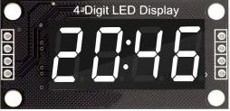

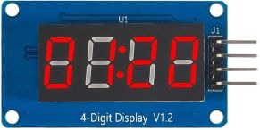
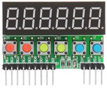

**TM1638**

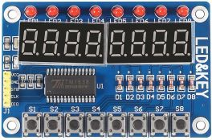
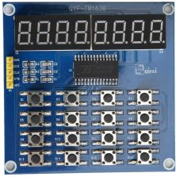

**MAX7219**

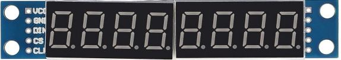

**HT16K33**


**74HC595**

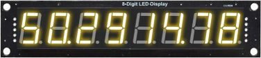

The final 2 types of modules (hybrid and directly connected) are usually custom
creations. Here is an example of an LED module that I built myself a few years
ago using a single 74HC595 chips and 4 transistors:

**Hybrid**

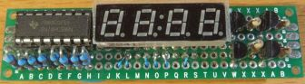

**Direct**


The AceSegment library hopes to support as many seven-segment displays as
practical within a single framework. Different types of seven-segment LED
modules using different controller chips are similar enough to each other that
code at the application layer can be mostly agnostic to the hardware
differences. The library is organized into hardware-dependent components and
hardware-independent components to allow application code to be written without
worrying too much about the low-level details of the specific LED module.

This library is designed to ensure that client applications pay only for what
they use. Most of the code is written as C++ templates to avoid creating static
resources that cannot be optimized away. No virtual methods are used in this
library, making the code size smaller and execution speed a little faster. There
is no direct dependency to the `<Wire.h>`, `<SPI.h>`, `<AceWire.h>`,
`<AceSPI.h>`, or `<AceTMI.h>` libraries from this library. (On AVR processors,
simply adding `#include <Wire.h>` increases flash usage by about 1100 bytes even
if nothing is used from the `<Wire.h>` library.)

**Version**: 0.13.0 (2023-03-15)

**Status**: First public release at 0.9.1.

**Changelog**: [CHANGELOG.md](CHANGELOG.md)

## Table of Contents

* [Installation](#Installation)
    * [Source Code](#SourceCode)
    * [Dependencies](#Dependencies)
* [Documentation](#Documentation)
    * [Examples](#Examples)
* [High Level Overview](#HighLevelOverview)
    * [Classes](#Classes)
    * [Dependency Diagram](#DependencyDiagram)
    * [Digit and Segment Addressing](#DigitAndSegmentAddressing)
    * [Remap Arrays](#RemapArrays)
    * [Hello Tm1637Module](#HelloTm1637Module)
    * [Hello Tm1638Module](#HelloTm1638Module)
    * [Hello Max7219Module](#HelloMax7219Module)
    * [Hello Ht16k33Module](#HelloHt16k33Module)
    * [Hello Hc595Module](#HelloHc595Module)
* [Usage](#Usage)
    * [Include Header and Namespace](#HeaderAndNamespace)
    * [LedModule](#LedModule)
    * [Tm1637Module](#Tm1637Module)
        * [TM1637 Module With 4 Digits](#Tm1637Module4)
        * [TM1637 Module With 6 Digits](#Tm1637Module6)
        * [TM1637 Module With 6 Digits and 6 Buttons](#Tm1637Module6Buttons)
    * [Tm1638Module](#Tm1638Module)
        * [TM1638 Module With 8 Digits and 8 Buttons](#Tm1638Module8Buttons)
        * [TM1638 Module With 8 Digits and 16 Buttons](#Tm1638Module16Buttons)
    * [Max7219Module](#Max7219Module)
        * [MAX7219 Module With 8 Digits](#Max7219Module8)
    * [Ht16k33Module](#Ht16k33Module)
        * [HT16K33 Module With 4 Digits](#Ht16k33Module4)
    * [Hc595Module](#Hc595Module)
        * [74HC595 Module With 8 Digits](#Hc595Module8)
        * [74HC595 Module With 4 Digits](#Hc595Module4)
        * [Rendering the Hc595Module](#RenderingHc595Module)
    * [HybridModule](#HybridModule)
    * [DirectModule](#DirectModule)
* [Advanced Usage](#AdvancedUsage)
    * [TM1637 Capacitor Removal](#Tm1637CapacitorRemoval)
    * [DigitalWriteFast on AVR](#DigitalWriteFast)
    * [Multiple SPI Buses](#MultipleSpiBuses)
    * [ScanningModule](#ScanningModule)
* [Resource Consumption](#ResourceConsumption)
    * [SizeOf Classes](#SizeOfClasses)
    * [Flash And Static Memory](#FlashAndStaticMemory)
    * [CPU Cycles](#CpuCycles)
* [System Requirements](#SystemRequirements)
    * [Hardware](#Hardware)
    * [Tool Chain](#ToolChain)
    * [Operating System](#OperatingSystem)
* [Bugs And Limitations](#BugsAndLimitations)
* [Alternative Libraries](#AlternativeLibraries)
* [License](#License)
* [Feedback and Support](#FeedbackAndSupport)
* [Authors](#Authors)

<a name="Installation"></a>
## Installation

The latest stable release is available in the Arduino IDE Library Manager.
Search for "AceSegment". Click install.

The development version can be installed by cloning the
[GitHub repository](https://github.com/bxparks/AceSegment), checking out the
default `develop` branch, then manually copying over to or symlinking from the
`./libraries` directory used by the Arduino IDE. (The result is a directory
or a link named `./libraries/AceSegment`.)

The `master` branch contains the stable releases.

<a name="SourceCode"></a>
### Source Code

The source files are organized as follows:
* `src/AceSegment.h` - main header file
* `src/ace_segment/` - implementation files
* `src/ace_segment/testing/` - internal testing files
* `tests/` - unit tests which require [AUnit](https://github.com/bxparks/AUnit)
* `examples/` - example sketches
* `docs/` - contains the doxygen docs and additional manual docs

<a name="Dependencies"></a>
### Dependencies

This library library has a direct dependency on:

* AceCommon (https://github.com/bxparks/AceCommon)

The following libraries are listed in the `depends` clause of
`library.properties` so that they are automatically installed by the Arduino
Library Manager for convenience. However these libraries are pulled into the
executable only when the client application explicitly uses them.

* AceSPI (https://github.com/bxparks/AceSPI)
    * Needed by `Hc595Module`, `Max7219Module`, and `HybridModule`
* AceTMI (https://github.com/bxparks/AceTMI)
    * Needed by `Tm1637Module` and `Tm1638Module`
* AceWire (https://github.com/bxparks/AceWire)
    * Needed by `Ht16k33Module`

The following library is a companion library to AceSegment that provides more
powerful and convenient "Writer" classes. It is not listed in the `depends`
clause, so must be installed manually:

* AceSegmentWriter (https://github.com/bxparks/AceSegmentWriter)
    * Provides more powerful and convenient classes to write quantities
      (numbers, characters, strings, etc) to the LED module.

The unit tests depend on:

* AUnit (https://github.com/bxparks/AUnit)

Some of the examples may depend on:

* TimerOne (https://github.com/PaulStoffregen/TimerOne)
* one of the DigitalWriteFast libraries, for example:
    * https://github.com/watterott/Arduino-Libs/tree/master/digitalWriteFast
    * https://github.com/NicksonYap/digitalWriteFast

<a name="Documentation"></a>
## Documentation

* this `README.md` file
* [DEVELOPER.md](DEVELOPER.md)
    * Internal technical notes to developers of the library.
* [scanning_module.md](docs/scanning_module.md)
    * Information about `ScanningModule` and `LedMatrix` classes. These are the
      implementation classes for `Hc595Module`, `HybridModule` and
      `DirectModule`.
* [capacitor_removal.md](docs/tm1637/capacitor_removal.md)
    * Removing the 10 nF capacitors on certain TM1637 LED modules
* [Doxygen docs](https://bxparks.github.io/AceSegment/html)
    * On Github pages.

<a name="Examples"></a>
### Examples

The following example sketches are provided:

* Basic
    * [HelloTm1637.ino](examples/HelloTm1637)
    * [HelloTm1638.ino](examples/HelloTm1638)
    * [HelloMax7219.ino](examples/HelloMax7219)
    * [HelloHt16k33.ino](examples/HelloHt16k33)
    * [HelloHc595.ino](examples/HelloHc595)
* Intermediate
    * [Tm1637Demo.ino](examples/Tm1637Demo)
    * [Tm1638Demo.ino](examples/Tm1638Demo)
    * [Tm1638AnodeDemo.ino](examples/Tm1638AnodeDemo)
    * [Max7219Demo.ino](examples/Max7219Demo)
    * [Ht16k33Demo.ino](examples/Ht16k33Demo)
    * [Hc595Demo.ino](examples/Hc595Demo)
* Advanced
    * [DirectDemo.ino](examples/DirectDemo)
        * Demo of an LED module with no controller, all digit and segment pins
          wired directly to the microcontroller
        * Uses `DirectModule` class
    * [DirectFast4Demo.ino](examples/DirectFast4Demo)
        * same as `DirectDemo` but using `DirectFast4Module` which uses
          `digitalWriteFast()`
    * [HybridDemo.ino](examples/HybridDemo)
        * Demo of an LED module that uses a single 74HC595 shift register on the
          segment pins, but the digit pins are wired directly to the
          microcontroller
        * Uses `HybridModule` class
    * [Tm1637DualDemo.ino](examples/Tm1637DualDemo)
        * render two TM1637 LED modules at the same time using two
          `Tm1637Module` instances
    * [ModulatingDemo.ino](examples/ModulatingDemo)
        * Demo of brightness control on a per-digit basis using `DirectModule`,
          `HybridModule`, or `Hc595Module`
    * [ScanningDemo.ino](examples/ScanningDemo)
        * Low-level demo `ScanningModule` combined with various
          `LedMatrixDirect`, `LedMatrixSingleHc595` and `LedMatrixDualHc595`
          classes
        * Not intended for general public consumption.
    * [Hc595InterruptDemo.ino](examples/Hc595InterruptDemo)
        * Same as Hc595Demo, but using an interrupt service routine (ISR)
          to render the LED display.
        * Uses the `TimerOne` (https://github.com/PaulStoffregen/TimerOne)
          library
        * CAUTION: See note about interrupt-safety at the top of the
          [Hc595InterruptDemo.ino](examples/Hc595InterruptDemo/Hc595InterruptDemo.ino)
          file.
    * [Tm1637ButtonDemo.ino](examples/Tm1637ButtonDemo)
        * Demo of keypad button scanning on the TM1637.
        * Reads the 6 buttons on the TM1637 LED module, and displays which
          button was pressed.
    * [Tm1638ButtonDemo.ino](examples/Tm1638ButtonDemo)
        * Demo of keypad button scanning on the TM1638.
        * Reads the 8 buttons on the TM1638 LED module, and displays the
          state of the buttons on each digit of the LED display.
* Benchmarks
    * [AutoBenchmark.ino](examples/AutoBenchmark): performs CPU benchmarking of
      most of the supported configurations of the framework
    * [MemoryBenchmark.ino](examples/MemoryBenchmark): determines the size of
      the various components of the library

<a name="HighLevelOverview"></a>
## High Level Overview

<a name="Classes"></a>
### Classes

Here are the classes in the library which will be most useful to the
end-users, listed roughly from low-level classes to higher-level classes:

* Communication Libraries
    * [AceSPI](https://github.com/bxparks/AceSPI)
        * Provides the SPI communication classes needed by `Hc595Module`,
          `Max7219Module`, and `HybridModule`.
        * There are 4 implementations:
            * `HardSpiInterface`: native `<SPI.h>` with `digitalWrite()`
            * `HardSpiFastInterface`: native `<SPI.h>` with `digitalWriteFast()`
            * `SimpleSpiInterface`: software SPI with `digitalWrite()`
            * `SimpleSpiFastInterface`: software SPI with `digitalWriteFast()`
    * [AceTMI](https://github.com/bxparks/AceTMI)
        * Provides communication to the TM1637 and TM1638 controller chips
          needed by the `Tm1637Module` and `Tm1638Module`.
        * There are 4 implementations:
            * `SimpleTmi1637Interface`: using `digitalWrite()`
            * `SimpleTmi1637FastInterface`: using `digitalWriteFast()`
            * `SimpleTmi1638Interface`: using `digitalWrite()`
            * `SimpleTmi1638FastInterface`: using `digitalWriteFast()`
    * [AceWire](https://github.com/bxparks/AceWire)
        * Provides the I2C communication classes used by `Ht16k33Module`.
        * Currently, it provides access to at least 10 I2C implementations, but
          the 3 that I recommend in most cases are:
            * `TwoWireInterface`: native `<Wire.h>`
            * `SimpleWireInterface`: software I2C using `digitalWrite()`
            * `SimpleWireFastInterface`: software I2C using `digitalWriteFast()`
* `LedModule`
    * Base interface for all hardware dependent implementation of a
      seven-segment LED module.
    * `Tm1637Module`
        * An implementation using a TM1637 controller.
    * `Tm1638Module`
        * An implementation using a TM1638 controller.
    * `Max7219Module`
        * An implementation using a MAX7219 controller.
    * `Ht16k33Module`
        * An implementation using an HT16K33 controller.
    * `Hc595Module`
        * An implementation using two 74HC595 shift registers.
    * `HybridModule`
        * An implementation using one 74HC595 shift registers
          to handle the 8 segment lines, with the digit lines directly connected
          to the GPIO pins of the micrcontroller.
    * `DirectModule`
        * An implementation with all segment and digit pins connected directly
          to the microcontroller.
* Writer classes
    * The [AceSegmentWriter](https://github.com/bxparks/AceWire) companion
      library provides more powerful and convenient classes to write numbers,
      characters, and strings to the LED modules.

<a name="DependencyDiagram"></a>
### Dependency Diagram

The conceptual dependency diagram among these classes and the companion
libraries (AceTMI, AceSPI, AceWire, AceSegmentWriter) looks something like this:

```
                      +---------------------+
                      | AceSegmentWriter    |
                      |---------------------|
                      | PatternWriter       |
                      | NumberWriter        |
                      | ClockWriter         |
                      | TemperatureWriter   |
                      | CharWriter          |
                      | StringWriter        |
                      | LevelWriter         |
                      | StringScroller      |
                      +---------------------+
                                |
                                | (recommended, but optional)
                                v
                             LedModule
                                ^                        (hardware independent)
--------------------------------|----------------------------------------------
                                |                          (hardware dependent)
                                |
      +-----------+-------------+-------------+-------------+-----------+
      |           |             |             |             |           |
Tm1637Module  Max7219Module Hc595Module HybridModule Ht16k33Module DirectModule
Tm1638Module              \     |            /              |
Tm1638AnodeModule          \    |           /               |
      |                     \   |          /                |
      v                      v  v         v                 v
+-------------------------+ +---------------------+ +----------------------+
| AceTMI library          | | AceSPI library      | | AceWire library      |
|-------------------------| |---------------------| |----------------------|
| SimpleTmi1637I'face     | | HardSpiI'face       | | TwoWireI'face        |
| SimpleTmi1637FastI'face | | HardSpiFastI'face   | | SimpleWireI'face     |
| SimpleTmi1638I'face     | | SimpleSpiI'face     | | SimpleWireFastI'face |
| SimpleTmi1638FastI'face | | SimpleSpiFastI'face | +----------------------+
+-------------------------+ +---------------------+         |
                                    |                       |
                                    v                       v
                                 <SPI.h>                 <Wire.h>
```

(The actual dependency among various classes is a bit more complicated than this
diagram.)

<a name="DigitAndSegmentAddressing"></a>
### Digit and Segment Addressing

The `LedModule` classes use the following conventions for addressing the digits
and segments:

* digits start at position 0 on the left and increase to the right
* segments are assigned bits 0 to 7 of an unsigned byte (type `uint8_t`) with
  segment `a` assigned to bit 0, segment `g` assigned to bit 6, and the optional
  decimal point assigned to bit 7

```
+------------+  +------------+           +------------+
|   aaaa     |  |   aaaa     |           |   aaaa     |
|  f    b    |  |  f    b    |           |  f    b    |
|  f    b    |  |  f    b    |           |  f    b    |
|   gggg     |  |   gggg     |  *  *  *  |   gggg     |
|  e    c    |  |  e    c    |           |  e    c    |
|  e    c    |  |  e    c    |           |  e    c    |
|   dddd  dp |  |   dddd  dp |           |   dddd  dp |
+------------+  +------------+           +------------+
  Digit 0         Digit 1                 Digit {N-1}


Segment: dp g f e d c b a
   Bit:  7  6 5 4 3 2 1 0
```

Some 4-digit LED modules are designed to be used in a clock to display the hour
and minute components of the time as `HH:MM`. In these modules, it is common for
the decimal point on Digit 1 to be replaced with the `colon` segment between
Digit 1 and Digit 2. In these modules, sometimes the decimal points for the
other digits work normally, but sometimes, the remaining decimal points do not
work at all.

<a name="RemapArrays"></a>
### Remap Arrays

Sometimes the LED modules are hardwired to the controller chips so that the
positions of the digits (and sometimes segments) do not not match the logical
arrangement described above. For example, the diymore/robotdyn 6-digit TM1637
LED module is wired so that the digits are displayed like this:

```
2 1 0 5 4 3
```

Fortunately, we can rearrange the digit and segment bits in software so that
everything is remapped to their correct places. The constructors for
`Tm1637Module`, `Max7219Module`, and `Hc595Module` accept an optional parameter
which describes the remapping of the digits. The library provides some
predefined remap arrays which work for the LED modules that I obtained from the
retail stores:

* `kDigitRemapArray8Max7219`: reverses the digits on the 8-digit MAX7219 modules
* `kDigitRemapArray8Hc595`: swaps the 2 banks of 4-digits on the 8-digit 74HC595
  modules
* `kDigitRemapArray6Tm1637`: rearranges the digits on the 6-digit TM1637 modules

Custom remap arrays can be created for LED modules which use different ordering
schemes. The [DEVELOPER.md](DEVELOPER.md) document has some preliminary notes
about how to create a remap array.

<a name="HelloTm1637Module"></a>
### Hello Tm1637Module

Here is the simple example program from
[examples/HelloTm1637](examples/HelloTm1637). It writes the digits 0-3 into a
4-digit LED module using the TM1637 chip, sets the brightness, then renders the
digits by flushing the data bits to the TM1637 controller using the
`SimpleTmi1637Interface` class from the AceTMI library.

```C++
#include <Arduino.h>
#include <AceTMI.h> // SimpleTmi1637Interface
#include <AceSegment.h> // Tm1637Module

using ace_tmi::SimpleTmi1637Interface;
using ace_segment::Tm1637Module;

// Replace these with the PIN numbers of your dev board.
const uint8_t CLK_PIN = A0;
const uint8_t DIO_PIN = 9;
const uint8_t NUM_DIGITS = 4;

// Many TM1637 LED modules contain 10 nF capacitors on their DIO and CLK lines
// which are unreasonably high. This forces a 100 microsecond delay between
// bit transitions. If you remove those capacitors, you can set this as low as
// 1-5 micros.
const uint8_t DELAY_MICROS = 100;

using TmiInterface = SimpleTmi1637Interface;
TmiInterface tmiInterface(DIO_PIN, CLK_PIN, DELAY_MICROS);
Tm1637Module<TmiInterface, NUM_DIGITS> ledModule(tmiInterface);

const uint8_t NUM_PATTERNS = 10;
const uint8_t PATTERNS[NUM_PATTERNS] = {
  0b00111111, // 0
  0b00000110, // 1
  0b01011011, // 2
  0b01001111, // 3
  0b01100110, // 4
  0b01101101, // 5
  0b01111101, // 6
  0b00000111, // 7
  0b01111111, // 8
  0b01101111, // 9
};

void setup() {
  delay(1000);

  tmiInterface.begin();
  ledModule.begin();

  ledModule.setPatternAt(0, PATTERNS[0]);
  ledModule.setPatternAt(1, PATTERNS[1]);
  ledModule.setPatternAt(2, PATTERNS[2]);
  ledModule.setPatternAt(3, PATTERNS[3]);

  ledModule.setBrightness(2);

  ledModule.flush();
}

void loop() {}
```

<a name="HelloTm1638Module"></a>
### Hello Tm1638Module

Here is the simple example program from
[examples/HelloTm1638](examples/HelloTm1638). It writes the digits 0-7 into an
8-digit LED module using the TM1638 chip, sets the brightness, then renders the
digits by flushing the data bits to the TM1638 controller using the
`SimpleTmi1638Interface` class from the AceTMI library.

```C++
#include <Arduino.h>
#include <AceTMI.h> // SimpleTmi1638Interface
#include <AceSegment.h> // Tm1638Module

using ace_tmi::SimpleTmi1638Interface;
using ace_segment::Tm1638Module;

// Replace these with the PIN numbers of your dev board.
// The TM1638 protocol is very similar to SPI, so I often use the SPI pins.
const uint8_t CLK_PIN = SCK;
const uint8_t DIO_PIN = MOSI;
const uint8_t STB_PIN = SS;
const uint8_t NUM_DIGITS = 8;

// My TM1638 LED module contains no filtering capacitor on the DIO, CLK, and STB
// lines. So it should support the highest clock frequency using a 1 micro
// transition delay.
const uint8_t DELAY_MICROS = 1;

using TmiInterface = SimpleTmi1638Interface;
TmiInterface tmiInterface(DIO_PIN, CLK_PIN, STB_PIN, DELAY_MICROS);
Tm1638Module<TmiInterface, NUM_DIGITS> ledModule(tmiInterface);

const uint8_t NUM_PATTERNS = 10;
const uint8_t PATTERNS[NUM_PATTERNS] = {
  0b00111111, // 0
  0b00000110, // 1
  0b01011011, // 2
  0b01001111, // 3
  0b01100110, // 4
  0b01101101, // 5
  0b01111101, // 6
  0b00000111, // 7
  0b01111111, // 8
  0b01101111, // 9
};

void setup() {
  delay(1000);

  tmiInterface.begin();
  ledModule.begin();

  ledModule.setPatternAt(0, PATTERNS[0]);
  ledModule.setPatternAt(1, PATTERNS[1]);
  ledModule.setPatternAt(2, PATTERNS[2]);
  ledModule.setPatternAt(3, PATTERNS[3]);
  ledModule.setPatternAt(4, PATTERNS[4]);
  ledModule.setPatternAt(5, PATTERNS[5]);
  ledModule.setPatternAt(6, PATTERNS[6]);
  ledModule.setPatternAt(7, PATTERNS[7]);

  ledModule.setBrightness(2);

  ledModule.flush();
}

void loop() {}
```

<a name="HelloMax7219Module"></a>
### Hello Max7219Module

Here is the simple example program from
[examples/HelloMax7219](examples/HelloMax7219). It writes the digits 0-7 into an
8-digit LED module using the MAX7219 chip, sets the brightness, then renders the
digits by flushing the data bits to the MAX7219 controller over SPI using the
`HardSpiInterface` class from the AceSPI library.

```C++
#include <Arduino.h>
#include <SPI.h> // SPIClass, SPI
#include <AceSPI.h> // HardSpiInterface
#include <AceSegment.h> // Max7219Module

using ace_spi::HardSpiInterface;
using ace_segment::Max7219Module;
using ace_segment::kDigitRemapArray8Max7219;

// Replace these with the PIN numbers of your dev board.
const uint8_t LATCH_PIN = 10;
const uint8_t DATA_PIN = MOSI;
const uint8_t CLOCK_PIN = SCK;
const uint8_t NUM_DIGITS = 8;

using SpiInterface = HardSpiInterface<SPIClass>;
SpiInterface spiInterface(SPI, LATCH_PIN);
Max7219Module<SpiInterface, NUM_DIGITS> ledModule(
    spiInterface, kDigitRemapArray8Max7219);

const uint8_t NUM_PATTERNS = 10;
const uint8_t PATTERNS[NUM_PATTERNS] = {
  0b00111111, // 0
  0b00000110, // 1
  0b01011011, // 2
  0b01001111, // 3
  0b01100110, // 4
  0b01101101, // 5
  0b01111101, // 6
  0b00000111, // 7
  0b01111111, // 8
  0b01101111, // 9
};

void setup() {
  delay(1000);

  SPI.begin();
  spiInterface.begin();
  ledModule.begin();

  ledModule.setPatternAt(0, PATTERNS[0]);
  ledModule.setPatternAt(1, PATTERNS[1]);
  ledModule.setPatternAt(2, PATTERNS[2]);
  ledModule.setPatternAt(3, PATTERNS[3]);
  ledModule.setPatternAt(4, PATTERNS[4]);
  ledModule.setPatternAt(5, PATTERNS[5]);
  ledModule.setPatternAt(6, PATTERNS[6]);
  ledModule.setPatternAt(7, PATTERNS[7]);

  ledModule.setBrightness(2);

  ledModule.flush();
}

void loop() {}
```

<a name="HelloHt16k33Module"></a>
### Hello Ht16k33Module

Here is the simple example program from
[examples/HelloHt16k33](examples/HelloHt16k33). It writes the digits 0-3 into a
4-digit LED module using the HT16K33 chip, sets the brightness, then renders the
digits by flushing the data bits to the HT16K33 controller over I2C using the
`TwoWireInterface` class from the AceWire library.

```C++
#include <Arduino.h>
#include <Wire.h> // TwoWire, Wire
#include <AceWire.h> // TwoWireInterface
#include <AceSegment.h> // Ht16k33Module

using ace_wire::TwoWireInterface;
using ace_segment::Ht16k33Module;

// Replace these with the PIN numbers of your dev board.
const uint8_t SDA_PIN = SDA;
const uint8_t SCL_PIN = SCL;
const uint8_t HT16K33_I2C_ADDRESS = 0x70;
const uint8_t NUM_DIGITS = 4;

using WireInterface = TwoWireInterface<TwoWire>;
WireInterface wireInterface(Wire);
Ht16k33Module<WireInterface, NUM_DIGITS> ledModule(
    wireInterface, HT16K33_I2C_ADDRESS);

const uint8_t NUM_PATTERNS = 10;
const uint8_t PATTERNS[NUM_PATTERNS] = {
  0b00111111, // 0
  0b00000110, // 1
  0b01011011, // 2
  0b01001111, // 3
  0b01100110, // 4
  0b01101101, // 5
  0b01111101, // 6
  0b00000111, // 7
  0b01111111, // 8
  0b01101111, // 9
};

void setup() {
  delay(1000);

  Wire.begin();
  wireInterface.begin();
  ledModule.begin();

  ledModule.setPatternAt(0, PATTERNS[0]);
  ledModule.setPatternAt(1, PATTERNS[1]);
  ledModule.setPatternAt(2, PATTERNS[2]);
  ledModule.setPatternAt(3, PATTERNS[3]);
  ledModule.setPatternAt(4, PATTERNS[4]);
  ledModule.setPatternAt(5, PATTERNS[5]);
  ledModule.setPatternAt(6, PATTERNS[6]);
  ledModule.setPatternAt(7, PATTERNS[7]);

  ledModule.setBrightness(2);

  ledModule.flush();
}

void loop() {}
```

<a name="HelloHc595Module"></a>
### Hello Hc595Module

Here is the simple example program from
[examples/HelloHc595](examples/HelloHc595). It writes the digits 0-7 into an
8-digit LED module using two 74HC595 chips, then renders the digits by flushing
the data bits to the 74HC595 controllers over SPI using the `HardSpiInterface`
class from the AceSPI library. The rendering must be multiplexed in the global
`loop()` function because the 74HC595 turns on only a single segment of each
digit at any given time. We have to strobe through all the segments faster than
the human vision response time (~16 ms) to give the illusion of illuminating the
entire display.

```C++
#include <Arduino.h>
#include <SPI.h> // SPIClass, SPI
#include <AceSPI.h> // HardSpiInterface
#include <AceSegment.h> // Hc595Module

using ace_spi::HardSpiInterface;
using ace_segment::Hc595Module;
using ace_segment::kDigitRemapArray8Hc595;
using ace_segment::kByteOrderSegmentHighDigitLow;
using ace_segment::kActiveLowPattern;
using ace_segment::kActiveHighPattern;

// Replace these with the PIN numbers of your dev board.
const uint8_t LATCH_PIN = 10;
const uint8_t DATA_PIN = MOSI;
const uint8_t CLOCK_PIN = SCK;
const uint8_t NUM_DIGITS = 8;

const uint8_t SEGMENT_ON_PATTERN = kActiveLowPattern;
const uint8_t DIGIT_ON_PATTERN = kActiveHighPattern;
const uint8_t HC595_BYTE_ORDER = kByteOrderSegmentHighDigitLow;
const uint8_t* const REMAP_ARRAY = kDigitRemapArray8Hc595;
const uint8_t NUM_SUBFIELDS = 1;
const uint8_t FRAMES_PER_SECOND = 60;

using SpiInterface = HardSpiInterface<SPIClass>;
SpiInterface spiInterface(SPI, LATCH_PIN);
Hc595Module<SpiInterface, NUM_DIGITS, NUM_SUBFIELDS> ledModule(
    spiInterface,
    SEGMENT_ON_PATTERN,
    DIGIT_ON_PATTERN,
    FRAMES_PER_SECOND,
    HC595_BYTE_ORDER,
    REMAP_ARRAY
);

const uint8_t NUM_PATTERNS = 10;
const uint8_t PATTERNS[NUM_PATTERNS] = {
  0b00111111, // 0
  0b00000110, // 1
  0b01011011, // 2
  0b01001111, // 3
  0b01100110, // 4
  0b01101101, // 5
  0b01111101, // 6
  0b00000111, // 7
  0b01111111, // 8
  0b01101111, // 9
};

void setup() {
  delay(1000);

  SPI.begin();
  spiInterface.begin();
  ledModule.begin();

  ledModule.setPatternAt(0, PATTERNS[0]);
  ledModule.setPatternAt(1, PATTERNS[1]);
  ledModule.setPatternAt(2, PATTERNS[2]);
  ledModule.setPatternAt(3, PATTERNS[3]);
  ledModule.setPatternAt(4, PATTERNS[4]);
  ledModule.setPatternAt(5, PATTERNS[5]);
  ledModule.setPatternAt(6, PATTERNS[6]);
  ledModule.setPatternAt(7, PATTERNS[7]);

  // Brightness not supported when NUM_SUBFIELDS == 1.
  // ledModule.setBrightness(2);
}

void loop() {
  ledModule.renderFieldWhenReady();
}
```

<a name="Usage"></a>
## Usage

<a name="HeaderAndNamespace"></a>
### Include Header and Namespace

Only a single header file `AceSegment.h` is required to use this library.
To prevent name clashes with other libraries that the calling code may use, all
classes are defined in the `ace_segment` namespace. To use the code without
prepending the `ace_segment::` prefix, use the `using` directive:

```C++
#include <Arduino.h>
#include <AceSegment.h>
using namespace ace_segment;
```

<a name="LedModule"></a>
### LedModule

The `LedModule` class provides the minimal interface to assign LED segment bit
patterns to specific digits, and to assign the global brightness. It is the
parent class of all hardware-dependent classes which are targeted for specific
controller chips. It looks like this:

```C++
namespace ace_segment {

class LedModule {
  public:
    explicit LedModule(uint8_t* patterns, uint8_t numDigits);

    uint8_t size() const;
    void setPatternAt(uint8_t pos, uint8_t pattern);
    uint8_t getPatternAt(uint8_t pos) const;
    void setBrightness(uint8_t brightness);
    uint8_t getBrightness() const;
    void setDecimalPointAt(uint8_t pos, bool state = true);
};

}
```

The subclasses will use C++ templates to accept a compile-time constant that
allows the creation of an internal buffer to hold the LED segment bit patterns
for each digit. The pointer to this internal buffer (`patterns`) is passed up to
the `LedModule` parent class through the constructor.

Some LED controllers (e.g. TM1637, MAX7219) handle the multiplexing and
refreshing of the LED segments, so the host microcontroller needs only to send
out the bit patterns to the controller chips over SPI or some other protocol.
Other controller chips, particularly the 74HC595, are not as capable and require
the host microcontroller to perform the multiplexing by itself. The bit patterns
must be sent out to the controller chip with precise timing intervals.

The `setBrightness()` method controls the brightness of the entire LED module.
The range of the `brightness` parameter is determined by the underlying
controller chip:

* TM1637
    * Supports 8 levels from 0 to 7, where 0 is the dimmest (but not off) and 7
      is the brightest.
    * Supports 2x8 buttons through the `readButtons()` method.
* TM1638
    * Supports 8 levels from 0 to 7, where 0 is the dimmest (but not off) and 7
      is the brightest.
    * Supports 3x8 buttons through the `readButtons()` method.
* MAX7219
    * Supports 16 levels from 0 to 15, where 0 is the dimmest (but not off), and
      15 is the brightest.
* HT16K33
    * Supports 16 levels from 0 to 15, where 0 is the dimmest level (but not
      off) and 15 being the brightest.
* 74HC595
    * The brightness is controlled directly by the microcontroller using pulse
      width modulation (PWM).
    * The range of values could theoretically be from 0 to 255, but in practice,
      it is limited by the speed of the microcontroller and the speed of the SPI
      transfer to the 74HC595 chip.
    * A brightness range of 0-7 or 0-15 seems practical for most configurations.
    * A value of 0 turns off the display.

If brightness control is enabled on the LED module using the 74HC595 chip, it
can also support brightness control on a per-digit basis. But the interface for
that feature is *not* part of the `LedModule` class because no other controller
chip supports this feature.

The `setDecimalPointAt(uint8_t pos, bool state=true)` method turns the decimal
point at position `pos` on (`state=true`) or off (`status=false`). The decimal
point stored in bit 7 (most significant bit) of the `pattern` at position `pos`.
It is possible to flip that bit manually when calling the `setPatternAt()`
function, but using `setDecimalPointAt()` is more convenient and allows for the
possibility that the decimal point could be stored somewhere else in the future.

The rendering of each digit and segment, and how the information is transferred
to the controller chip, is pushed down into the specific subclasses of
`LedModule`. The rendering methods are called `flush()`, `flushIncremental()`,
`renderNow()` or `renderWhenReady()`, Each controller chip has slightly
different rendering logic.

Early versions of the `LedModule` used `virtual` methods which consume
additional flash memory, static memory, and CPU cycles. They were changed to be
non-virtual, and various Writer classes which depended on the `LedModule` class
were converted to C++ template classes that are based on a generic
`T_LED_MODULE` type. No virtual methods are used in the AceSegment library.

<a name="Tm1637Module"></a>
### Tm1637Module

LED modules based on the Titan TM1637 controller chips are abundant on Amazon
and eBay. Most of LED modules are marked with "diymore.cc" as the manufacturer.
After purchasing a handful of these on eBay, I discovered that they seem to be
clones of the TM1637 modules from robotdyn.com. The schematics for these modules
can be found here:

* https://robotdyn.com/4-digit-led-display-tube-7-segments-tm1637-30x14mm.html
* https://robotdyn.com/4-digit-led-display-tube-7-segments-tm1637-50x19mm.html
* https://robotdyn.com/6-digit-led-display-tube-7-segments-46x14mm-tm1637.html
* https://robotdyn.com/6-digit-led-display-tube-7-segments-76x19mm-tm1637.html

The controller chip supports up to 6 digits. The LED modules from diymore.cc or
robotdyn.com seem have either 4 digits or 6 digits.

The `Tm1637Module` class looks like this:

```C++
namespace ace_segment {

template <typename T_TMII, uint8_t T_DIGITS>
class Tm1637Module : public LedModule {
  public:
    explicit Tm1637Module(
        const T_TMII& tmiInterface,
        const uint8_t* remapArray = nullptr
    );

    void begin();
    void end();

    // Following inherited from LedModule:
    // uint8_t size();
    // void setPatternAt(uint8_t pos, uint8_t pattern);
    // uint8_t getPatternAt(uint8_t pos);
    // void setBrightness(uint8_t brightness);

    void setDisplayOn(bool on = true);

    bool isFlushRequired() const;
    void flush();
    void flushIncremental();
};

}
```

The `T_TMII` template parameter is a class that implements the 2-wire protocol
used by the TM1637 controller. It is a protocol that is very close to, but not
quite the same as, I2C. This means that we cannot use the usual `<Wire.h>`
library, but must implement a custom version. The
[AceTMI](https://github.com/bxparks/AceTMI) library provides 2 implementations:
the `SimpleTmi1637Interface` compatible with all platforms, and
`SimpleTmi1637FastInterface` useful on AVR processors.

The `remapArray` is an array of addresses which map the physical positions to
their logical positions. This is not needed by the 4-digit TM1637 LED modules,
but the 6-digit TM1637 LED modules commonly available on Amazon or eBay are
wired so that the digits need remapping.

Most of the methods of the class are inherited from the `LedModule`. To reduce
flash consumption, these inherited methods are deliberately non-virtual.

The `setDisplayOn()` method exposes the feature of the TM1637 chip where the
display can be turned on and off independently of the brightness. When the
display is turned back on, it resumes the previous brightness.

The `flush()` method sends all digits and the brightness information to the
TM1637 chip in a single transmission. The total amount of time needed to
complete the `flush()` method is mostly dependent on the value of the
`BIT_DELAY` parameter.

Some TM1637 LED modules requires a large `BIT_DELAY` value as high as 100
microseconds, which causes `flush()` to take about about 22 millis. For 6
digits, this method takes about 27 millis. The `flush()` method is a blocking
call, nothing else can be done during this time (outside of interrupts). This
can be a problem for processors like the ESP8266 which must yield back to the
main loop every 20-40 milliseconds to keep its WiFi stack working. Otherwise,
the watch dog timer performs a system reboot.

The `flushIncremental()` method was created to reduce the amount of time spent
in the blocking call to `flush()`. This method sends only a single digit for
each iteration. The next time `flushIncremental()` is called, it sends the next
digit to the LED module. After all the digits are sent, one more iteration sends
the brightness information to the module. So the total number of iteration to
update the entire LED module is `NUM_DIGITS + 1`. For `BIT_DELAY` of 100
microseconds, `flushIncremental()` takes around 10 milliseconds per iteration.

The `isFlushRequired()` can be used to optimize the call to `flush()` or
`flushIncremental()` to only when it is necessary. This gives more CPU cycles to
the microcontroller to do other things, but there is always the small risk of
the LED display becoming out of sync with the internal state (e.g. if the
module loses power or the two wire communication becomes corrupted). In simple
applications, this optimization may not be needed.

<a name="Tm1637Module4"></a>
#### TM1637 Module With 4 Digits

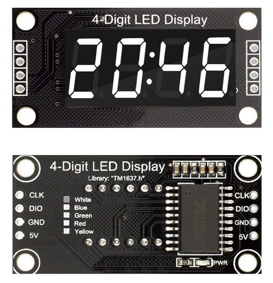

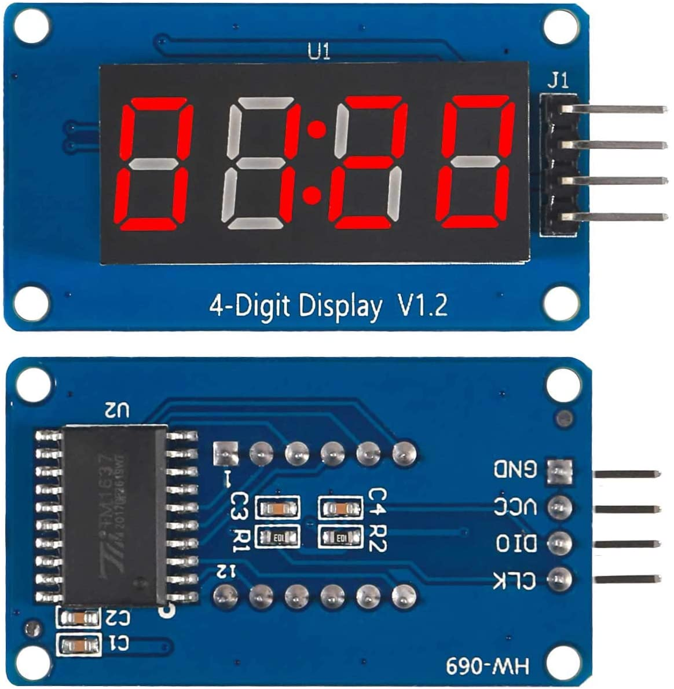

The configuration of the `Tm1637Module` class for the 4-digit module looks like
this (c.f. [examples/Tm1637Demo](examples/Tm1637Demo)):

```C++
#include <Arduino.h>
#include <AceTMI.h>
#include <AceSegment.h>
using ace_tmi::SimpleTmi1637Interface;
using ace_segment::Tm1637Module;

const uint8_t CLK_PIN = 10;
const uint8_t DIO_PIN = 9;
const uint8_t BIT_DELAY = 100;
const uint8_t NUM_DIGITS = 4;

using TmiInterface = SimpleTmi1637Interface;
TmiInterface tmiInterface(DIO_PIN, CLK_PIN, BIT_DELAY);
Tm1637Module<TmiInterface, NUM_DIGITS> ledModule(tmiInterface);

void setupAceSegment() {
  tmiInterface.begin();
  ledModule.begin();
}

// Flush to LED module every 20 millis.
void flushModule() {
  static uint16_t prevFlushMillis;

  uint16_t nowMillis = millis();
  if ((uint16_t) (nowMillis - prevFlushMillis) >= 20) {
    prevFlushMillis = nowMillis;
    //ledModule.flush();
    ledModule.flushIncremental();
  }
}

void setup() {
  setupAceSegment();
  ...
}

void loop() {
  flushModule();
  ...
}
```

The `BIT_DELAY` parameter above is the number of microseconds to wait between
each bit transition (0 to 1, or 1 to 0). According the datasheet of the TM1637
chip, it can support oscillator frequencies as high as 500 kHz, which means that
theoretically, the `BIT_DELAY` could be as low as 1 microseconds.

The black LED modules manufactured by diymore.cc (shown above)
contains a 10 nF capacitor and a 10k ohm pullup resistor on each of the `DIO`
and `CLK` lines. This requires a `BIT_DELAY` of 100 microseconds. See [TM1637
Capacitor Removal](#Tm1637CapacitorRemoval) for instructions on how to remove
these capacitors to allow the bit delay to be significantly lowered.

The blue LED modules (shown above) seem to use much smaller filtering
capacitors. These modules seem to work with a `BIT_DELAY` as low as 7
microseconds.

<a name="Tm1637Module6"></a>
#### TM1637 Module With 6 Digits

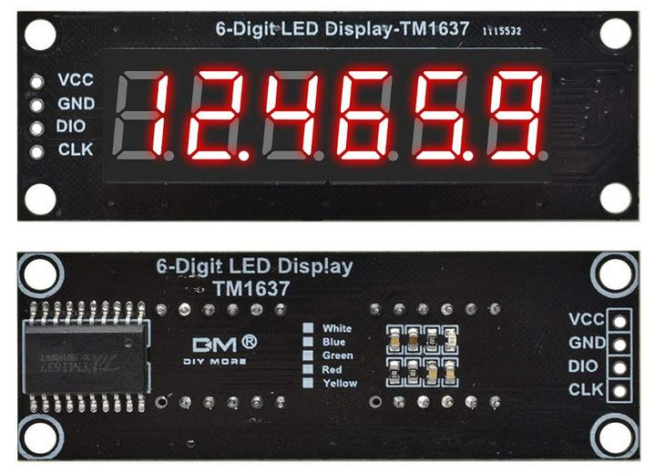

The configuration of the `Tm1637Module` class for the 6-digit module is slightly
more complicated because the digits are wired to be in the order of `2 1 0 5 4
3`. A predefined remap array `kDigitRemapArray6Tm1637` must be given to the
`Tm1637Module` constructor, like this
(c.f. [examples/Tm1637Demo](examples/Tm1637Demo)):

```C++
#include <Arduino.h>
#include <AceTMI.h>
#include <AceSegment.h>
using ace_tmi::SimpleTmi1637Interface;
using ace_segment::Tm1637Module;
using ace_segment::kDigitRemapArray6Tm1637;

const uint8_t CLK_PIN = 10;
const uint8_t DIO_PIN = 9;
const uint8_t BIT_DELAY = 100;
const uint8_t NUM_DIGITS = 4;

using TmiInterface = SimpleTmi1637Interface;
TmiInterface tmiInterface(DIO_PIN, CLK_PIN, BIT_DELAY);
Tm1637Module<TmiInterface, NUM_DIGITS> ledModule(
    tmiInterface, kDigitRemapArray6Tm1637);

void setupAceSegment() {
  tmiInterface.begin();
  ledModule.begin();
}

// Flush to LED module every 20 millis.
void flushModule() {
  static uint16_t prevFlushMillis;
  uint16_t nowMillis = millis();
  if ((uint16_t) (nowMillis - prevFlushMillis) >= 20) {
    prevFlushMillis = nowMillis;
    //ledModule.flush();
    ledModule.flushIncremental();
  }
}

void setup() {
  setupAceSegment();
  ...
}

void loop() {
  flushModule();
  ...
}
```

Just like the 4-digit versions, these 6-digit modules contain a 10 nF capacitor
and a 10k ohm pullup resistor on each of the `DIO` and `CLK` lines. This
requires a `BIT_DELAY` of 100 microseconds. See [TM1637 Capacitor
Removal](#Tm1637CapacitorRemoval) for instructions on how to remove these
capacitors to allow the bit delay to be significantly lowered.

<a name="Tm1637Module6Buttons"></a>
#### TM1637 Module With 6 Digits and 6 Buttons


This module is similar to the 6-digit module described above, with the following
difference:

* Its digits do *not* need to be remapped, so you can omit the
  `kDigitRemapArray6Tm1637` parameter from the code example above.
* It does not have 10nF capacitors on the DIO and CLK lines, so the `BIT_DELAY`
  can be as short as 4-5 microseconds.
* It comes with 6 buttons, which can be read through the
  `Tm1637Module::readButtons()` method. See
  [Tm1637ButtonDemo](examples/Tm1637ButtonDemo/) for details.

The configuration of `Tm1637Module` looks like this:

```C++
#include <Arduino.h>
#include <AceTMI.h>
#include <AceSegment.h>
using ace_tmi::SimpleTmi1637Interface;
using ace_segment::Tm1637Module;
using ace_segment::kDigitRemapArray6Tm1637;

const uint8_t CLK_PIN = 10;
const uint8_t DIO_PIN = 9;
const uint8_t BIT_DELAY = 5;
const uint8_t NUM_DIGITS = 4;

using TmiInterface = SimpleTmi1637Interface;
TmiInterface tmiInterface(DIO_PIN, CLK_PIN, BIT_DELAY);
Tm1637Module<TmiInterface, NUM_DIGITS> ledModule(tmiInterface);

...
```

<a name="Tm1638Module"></a>
### Tm1638Module

LED modules based on the Titan TM1638 controller chips are available on Amazon
and eBay. There seems to be 2 kinds readily available:

* an 8-digit LED display with 8 buttons and an additional set of 8 discrete LEDs
    * uses a Common Cathode LED module
* an 8-digit LED display with 16 buttons but no other LEDs
    * uses a Common Anode LED module

The `Tm1638Module` class is used for the Common Cathode version, which is
similar to most of the other modules in this library.

```C++
namespace ace_segment {

template <typename T_TMII, uint8_t T_DIGITS>
class Tm1638Module : public LedModule {
  public:
    explicit Tm1638Module(
        const T_TMII& tmiInterface,
        const uint8_t* remapArray = nullptr
    );

    void begin();
    void end();

    // Following inherited from LedModule:
    // uint8_t size();
    // void setPatternAt(uint8_t pos, uint8_t pattern);
    // uint8_t getPatternAt(uint8_t pos);
    // void setBrightness(uint8_t brightness);

    void setDisplayOn(bool on = true);

    bool isFlushRequired() const;
    void flush();
};

}
```

The `Tme1638ModuleAnode` is used for the Common Anode version and looks very
similar to the `Tm1638Module` class (except for the missing `remapArray`
parameter):

```C++
namespace ace_segment {

template <typename T_TMII, uint8_t T_DIGITS>
class Tm1638AnodeModule : public LedModule {
  public:
    explicit Tm1638AnodeModule(
        const T_TMII& tmiInterface
    );

    void begin();
    void end();

    // Following inherited from LedModule:
    // uint8_t size();
    // void setPatternAt(uint8_t pos, uint8_t pattern);
    // uint8_t getPatternAt(uint8_t pos);
    // void setBrightness(uint8_t brightness);

    void setDisplayOn(bool on = true);

    bool isFlushRequired() const;
    void flush();
};

}
```

The `T_TMII` template parameter is a class that implements the 2-wire protocol
used by the TM1638 controller. It is a protocol that is very close to, but not
quite the same as, SPI. This means that we cannot use the usual `<SPI.h>`
library, but must implement a custom version. The
[AceTMI](https://github.com/bxparks/AceTMI) library provides provides 2
implementations: the `SimpleTmi1638Interface` compatible with all platforms, and
`SimpleTmi1638FastInterface` useful on AVR processors.

The `remapArray` is an array of addresses which map the physical positions to
their logical positions. This was not needed by the 8-digit TM1638 LED modules
that I received, but maybe useful for other LED modules which configure the
ordering of the LED digits in a different way.

Most of the methods of the class are inherited from the `LedModule`. To reduce
flash consumption, these inherited methods are deliberately non-virtual.

The `setDisplayOn()` method exposes the feature of the TM1638 chip where the
display can be turned on and off independently of the brightness. When the
display is turned back on, it resumes the previous brightness.

The `flush()` method sends all digits and the brightness information to the
TM1638 chip in a single transmission. The total amount of time needed to
complete the `flush()` method is mostly dependent on the value of the
`BIT_DELAY` parameter. On an AVR processor, this method can take as little as
200 microseconds when using `SimpleTmi1638FastInterface` or as much as 2200
microseconds when using the normal `SimpleTmi1638Interface`.

The `BIT_DELAY` value controls the speed of the communication to the TM1638
controller. If the DIO, CLK, and STB lines have minimal (or no) filtering
capacitors, this value can be as low as 1 microseconds to potentially give a
throughput of 500 kbps.

The `isFlushRequired()` can be used to optimize the call to `flush()` to only
when it is necessary. This gives more CPU cycles to the microcontroller to do
other things, but there is always the small risk of the LED display becoming out
of sync with the internal state (e.g. if the module loses power or the
communication becomes corrupted). In simple applications, this optimization may
not be needed.

<a name="Tm1638Module8Buttons"></a>
#### TM1638 Module With 8 Digits and 8 Buttons

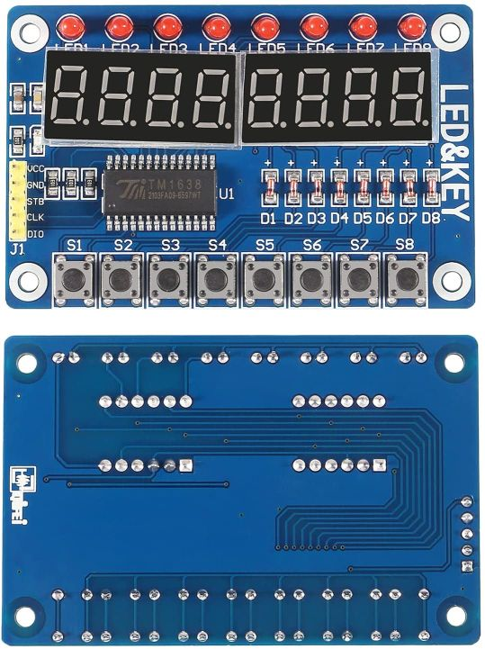

This dev module uses a TM1638 chip with an 8-digit Common Cathode LED module. So
the segment pattern layout is similar to most of the other modules.

The configuration of the `Tm1638Module` class for the 8-digit module looks like
this (c.f. [examples/Tm1638Demo](examples/Tm1638Demo)):

```C++
#include <Arduino.h>
#include <AceTMI.h>
#include <AceSegment.h>
using ace_tmi::SimpleTmi1638Interface;
using ace_segment::Tm1638Module;

const uint8_t CLK_PIN = SCK;
const uint8_t DIO_PIN = MOSI;
const uint8_t STB_PIN = SS;
const uint8_t BIT_DELAY = 1;
const uint8_t NUM_DIGITS = 8;

using TmiInterface = SimpleTmi1638Interface;
TmiInterface tmiInterface(DIO_PIN, CLK_PIN, STB_PIN, BIT_DELAY);
Tm1638Module<TmiInterface, NUM_DIGITS> ledModule(tmiInterface);

void setupAceSegment() {
  tmiInterface.begin();
  ledModule.begin();
}

// Flush to LED module every 100 millis.
void flushModule() {
  static uint16_t prevFlushMillis;

  uint16_t nowMillis = millis();
  if ((uint16_t) (nowMillis - prevFlushMillis) >= 100) {
    prevFlushMillis = nowMillis;
    ledModule.flush();
  }
}

void setup() {
  setupAceSegment();
  ...
}

void loop() {
  flushModule();
  ...
}
```

<a name="Tm1638Module16Buttons"></a>
#### TM1638 Module With 8 Digits and 16 Buttons

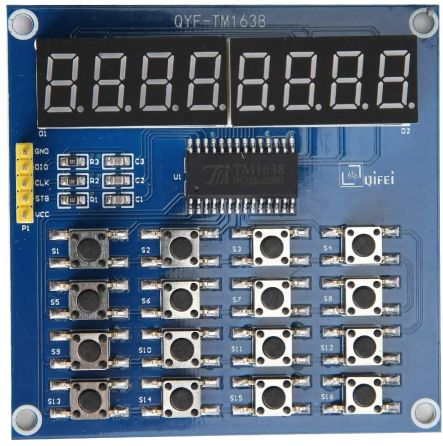

This dev module uses a TM1638 chip with an 8-digit Common **Anode** LED module.
This requires using the `Tm1638AnodeModule` class instead of the `Tm1638Module`
class.

The configuration of the `Tm1638AnodeModule` class is basically identical to
the `Tm1638Module` class (c.f.
[examples/Tm1638AnodeDemo](examples/Tm1638AnodeDemo)):

```C++
#include <Arduino.h>
#include <AceTMI.h>
#include <AceSegment.h>
using ace_tmi::SimpleTmi1638Interface;
using ace_segment::Tm1638AnodeModule;

const uint8_t CLK_PIN = SCK;
const uint8_t DIO_PIN = MOSI;
const uint8_t STB_PIN = SS;
const uint8_t BIT_DELAY = 1;
const uint8_t NUM_DIGITS = 8;

using TmiInterface = SimpleTmi1638Interface;
TmiInterface tmiInterface(DIO_PIN, CLK_PIN, STB_PIN, BIT_DELAY);
Tm1638AnodeModule<TmiInterface, NUM_DIGITS> ledModule(tmiInterface);

void setupAceSegment() {
  tmiInterface.begin();
  ledModule.begin();
}

// Flush to LED module every 100 millis.
void flushModule() {
  static uint16_t prevFlushMillis;

  uint16_t nowMillis = millis();
  if ((uint16_t) (nowMillis - prevFlushMillis) >= 100) {
    prevFlushMillis = nowMillis;
    ledModule.flush();
  }
}

void setup() {
  setupAceSegment();
  ...
}

void loop() {
  flushModule();
  ...
}
```

<a name="Max7219Module"></a>
### Max7219Module

These LED modules use the MAX7219 controller chip which communicate using SPI. A
single chip supports 8 segments of up to 8 digits. Multiple controller chips can
be daisychained to support more than 8 digits. LED modules with 8 digits are
readily available from multiple suppliers on Amazon and eBay, and they look like
this:

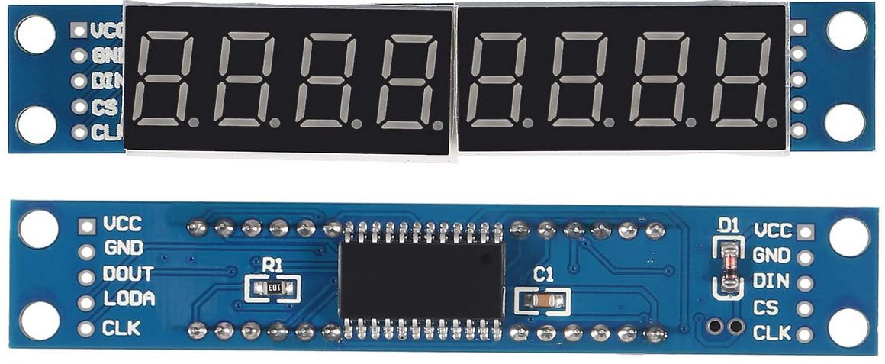

I have not found a circuit schematic for this module.

The `Max7219Module` class looks like this:

```C++
namespace ace_segment {

template <typename T_SPII, uint8_t T_DIGITS>
class Max7219Module : public LedModule {
  public:
    explicit Max7219Module(
        const T_SPII& spiInterface,
        const uint8_t* remapArray = nullptr
    );

    void begin();
    void end();

    // Following inherited from LedModule:
    // uint8_t size();
    // void setPatternAt(uint8_t pos, uint8_t pattern);
    // uint8_t getPatternAt(uint8_t pos);
    // void setBrightness(uint8_t brightness);

    bool isFlushRequired() const;
    void flush();
};

}
```

The `T_SPII` template parameter is one of the SPI interface classes from the
[AceSPI](https://github.com/bxparks/AceSPI) library, which provides 4
implementations: `HardSpiInterface`, `HardSpiFastInterface` (on AVR),
`SimpleSpiInterface`, and `SimpleSpiFastInterface` (on AVR).

The `T_DIGITS` is the number of digits in the LED module. Since this is a
compile-time constant, the `Hc595Module` class uses it to allocate a buffer of 8
bytes to hold the LED segment bit patterns. This allocation is done at
compile-time.

The `flush()` method sends the bit patterns to the MAX7219 controller using SPI.

The `isFlushRequired()` can be used to optimize the call to `flush()` to only
when it is necessary. This gives more CPU cycles to the microcontroller to do
other things, but there is always the small risk of the LED display becoming out
of sync with the internal state (e.g. if the module loses power or the SPI
communication becomes corrupted). In simple applications, this optimization may
not be needed.

<a name="Max7219Module8"></a>
#### MAX7219 Module with 8 Digits

The configuration of the `Max7219Module` class for the 8-digit module looks like
this (c.f. [examples/Max7219Demo](examples/Max7219Demo)):

```C++
#include <Arduino.h>
#include <SPI.h>
#include <AceSPI.h>
#include <AceSegment.h>
using ace_spi::HardSpiInterface;
using ace_segment::Max7219Module;
using ace_segment::kDigitRemapArray8Max7219;

const uint8_t LATCH_PIN = 10;
const uint8_t DATA_PIN = MOSI;
const uint8_t CLOCK_PIN = SCK;
const uint8_t NUM_DIGITS = 8;

using SpiInterface = HardSpiInterface<SPIClass>;
SpiInterface spiInterface(SPI, LATCH_PIN);
Max7219Module<SpiInterface, NUM_DIGITS> ledModule(
    spiInterface, kDigitRemapArray8Max7219);

void setupAceSegment() {
  SPI.begin();
  spiInterface.begin();
  ledModule.begin();
}

// Flush to LED module every 100 millis.
void flushModule() {
  static uint16_t prevFlushMillis;
  uint16_t nowMillis = millis();
  if ((uint16_t) (nowMillis - prevFlushMillis) >= 100) {
    prevFlushMillis = nowMillis;
    ledModule.flush();
  }
}

void setup() {
  setupAceSegment();
  ...
}

void loop() {
  flushModule();
  ...
}
```

The 8-digit LED modules that seem to be readily available on Amazon and eBay
seem to have their digits wired in the opposite orientation compared to the one
used in this library. In other words, digit 0 is on the far right, and digit 7
is on the far left. The `kDigitRemapArray8Max7219` array tells the
`Max7219Module` class to remap those digits so that they appear correct.

<a name="Ht16k33Module"></a>
### Ht16k33Module

These LED modules use the HT16K33 controller chip which communicates using I2C.
A single chip supports up to 16 segments and 8 digits, but the AceSegment
library supports modules with only 8 segments (7 segments plus decimal point).
Generic 4-digit modules are readily available from multiple suppliers on Amazon
and eBay, and they look like this:

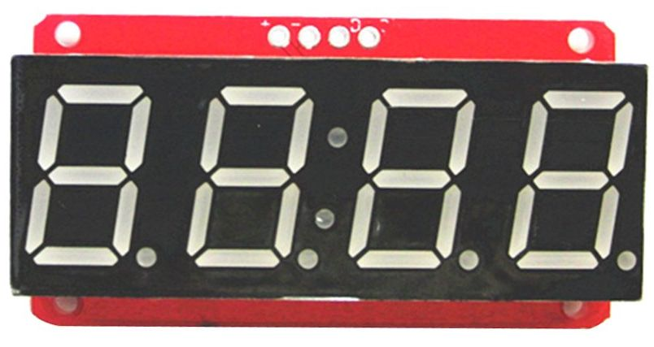

It was only after I purchased a set of these that I discovered that they seem to
be generic clones of the LED modules (https://www.adafruit.com/product/878)
available from [Adafruit](https://www.adafruit.com), such as these:

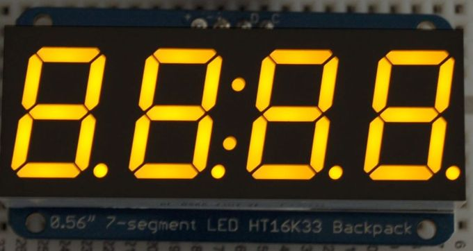

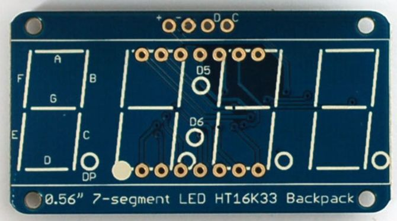
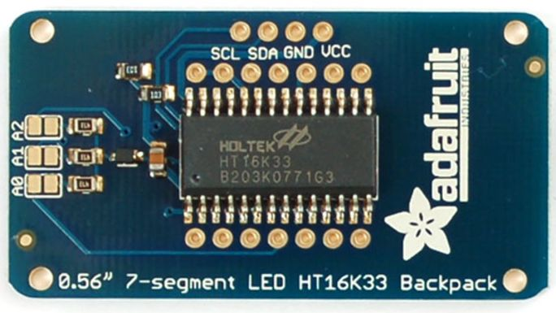

The `Ht16k33Module` class looks like this:

```C++
namespace ace_segment {

template <typename T_WIREI, uint8_t T_DIGITS>
class Ht16k33Module : public LedModule {
  public:
    explicit Ht16k33Module(
        T_WIREI& wireInterface,
        uint8_t addr,
        bool enableColon = false
    );

    void enableColon(bool enable);
    void begin();
    void end();

    // Following inherited from LedModule:
    // uint8_t size();
    // void setPatternAt(uint8_t pos, uint8_t pattern);
    // uint8_t getPatternAt(uint8_t pos);
    // void setBrightness(uint8_t brightness);

    bool isFlushRequired() const;
    void flush();
};

}
```

The `T_WIREI` template parameter is the class name of the Wire interface from
the [AceWire](https://github.com/bxparks/AceWire) library which provides 3
implementations of interest: `TwoWireInterface`, `SimpleWireInterface`, and
`SimpleWireFastInterface`.

The `T_DIGITS` template parameter is the number of digits in the module. I have
only seen 4 digit modules for sale, and the `Ht16k33Module` has specific code to
support that hardware, so currently, the `T_DIGITS` should always be set to 4.
If additional LED modules with different digits come on the market, the
`Ht16k33Module` class will be extended, or a new class will be created.

The `addr` parameter in the `Ht16k33Module` constructor is the I2C address of
the HT16K33 controller chip. The base address is `0x70`. The LED module exposes
3 jumpers that can be soldered in various combinations to change the I2C address
to one of the 8 addresses from 0x70 to 0x77.

The `flush()` method sends all 4 digits as well as the brightness setting to the
LED module using I2C.

The `isFlushRequired()` can be used to optimize the call to `flush()` to only
when it is necessary. This gives more CPU cycles to the microcontroller to do
other things, but there is always the small risk of the LED display becoming out
of sync with the internal state (e.g. if the module loses power or the I2C
communication becomes corrupted). In simple applications, this optimization may
not be needed.

The `enableColon` parameter and the `enableColon()` method determine whether the
colon segment between Digit 1 and Digit 2 of the LED module is active. The
4-digit HT16K33 LED clock modules from Adafruit and its clones allow the colon
segment to be controlled independently of the decimal point of Digit 1. But
AceSegment does not support controlling both the decimal point and the colon
segment *at the time same*. However, it allows selecting one or the other:

* `enableColon = false`
    * the module behave like a normal 4-digit LED module with its decimal
      point on Digit 1.
* `enableColon = true`
    * the module behaves like a 4-digit clock module with a colon segment
      between Digit 1 and Digit 2.

The `enableColon` parameter can be changed dynamically at runtime using the
`enableColon()` method.

<a name="Ht16k33Module4"></a>
#### HT16K33 Module with 4 Digits

The configuration of the `Ht16k33Module` class for the 4-digit Adfruit LED
module looks like this (c.f. [examples/Ht16k33Demo](examples/Ht16k33Demo)):

```C++
#include <Arduino.h>
#include <Wire.h> // TwoWire, Wire
#include <AceWire.h>
#include <AceSegment.h>
using ace_wire::TwoWireInterface;
using ace_segment::Ht16k33Module;

const uint8_t HT16K33_I2C_ADDRESS = 0x70;
const uint8_t SCL_PIN = SCL;
const uint8_t SDA_PIN = SDA;
const uint8_t NUM_DIGITS = 4;

using WireInterface = TwoWireInterface<TwoWire>;
WireInterface wireInterface(Wire);
Ht16k33Module<WireInterface, NUM_DIGITS> ledModule(
    wireInterface, HT16K33_I2C_ADDRESS);

void setupAceSegment() {
  Wire.begin();
  wireInterface.begin();
  ledModule.begin();
}

// Flush to LED module every 100 millis.
void flushModule() {
  static uint16_t prevFlushMillis;
  uint16_t nowMillis = millis();
  if ((uint16_t) (nowMillis - prevFlushMillis) >= 100) {
    prevFlushMillis = nowMillis;
    ledModule.flush();
  }
}

void setup() {
  setupAceSegment();
  ...
}

void loop() {
  flushModule();
  ...
}
```

<a name="Hc595Module"></a>
### Hc595Module

The 74HC595 shift register is a well-known chip that can be used to control
seven-segment LED modules. Each chip converts 8 serial bits into 8 parallel pins
which can source or sink about 12 mA of current each. With two 74HC595 chips,
one chip can control the segment pins, the other can control the common digit
pins, and the two chips can be daisy chained together. The chips can be
programmed using the straightforward SPI protocol.

Recently (since about Aug 2020?), off-the-shelf 8-digit LED modules using two
74HC595 have become common on Amazon and eBay, in multiple colors. Many of these
modules are made by diymore.cc, but they seem to be clones of the LED modules
from robotdyn.com. The schematics can be found here:

* https://robotdyn.com/8-digit-led-display-tube-7-segments-decimal-points-101x19mm-74hc595.html
  (8 digits)
* https://robotdyn.com/6-digit-led-display-tube-7-segments-74hc595.html
  (6 digits)

The 8-digit module looks like this:

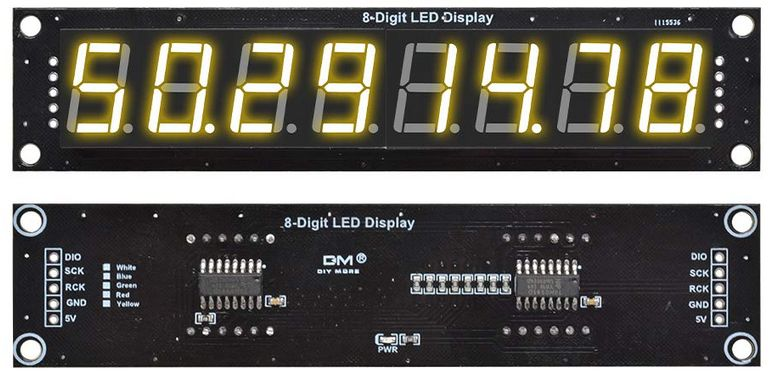

(I have not found a retail seller for the 6-digit 74HC595 module. Maybe
because if you need only 6 digits, it is likely easier and cheaper to use a
TM1637 controller, rather than the 74HC595 controller.)

The `Hc595Module` class looks roughly like this (simplified for ease of
understanding):

```C++
namespace ace_segment {

template <typename T_SPII, uint8_t T_DIGITS>
class Hc595Module : public ScanningModule<[snip]> {
  public:
    explicit Hc595Module(
        const T_SPII& spiInterface,
        uint8_t segmentOnPattern,
        uint8_t digitOnPattern,
        uint8_t framesPerSecond,
        uint8_t byteOrder,
        const uint8_t* remapArray = nullptr
    );

    void begin();
    void end();

    uint16_t getFramesPerSecond() const;
    uint16_t getFieldsPerSecond() const;
    uint16_t getFieldsPerFrame() const;

    // Following inherited from LedModule through ScanningModule:
    // uint8_t size();
    // void setPatternAt(uint8_t pos, uint8_t pattern);
    // uint8_t getPatternAt(uint8_t pos);
    // void setBrightness(uint8_t brightness);

    void setBrightness(uint8_t brightness);
    void setBrightnessAt(uint8_t pos, uint8_t brightness);

    bool renderFieldWhenReady();
    void renderFieldNow();
};

}
```

There are 2 template parameters. The `T_SPII` specifies the SPI interface which
will be used to communicate with the 74HC595 chips. There are 4 options provided
by the [AceSPI](https://github.com/bxparks/AceSPI) library: `HardSpiInterface`,
`HardSpiFastInterface` (on AVR), `SimpleSpiInterface`, and
`SimpleSpiFastInterface` (on AVR),

The `T_DIGITS` is the number of digits in the LED module. Since this is a
compile-time constant, the `Hc595Module` class uses it to allocate a buffer of 8
bytes to hold the LED segment bit patterns. This allocation is done at
compile-time.

The `spiInstance` object is an instance of the `T_SPII` class.

The `segmentOnPattern` and `digitOnPattern` specify the bit patterns needed to
turn on the LED at the specified segment and digit. This is determine by the
polarity of the wiring of LED segments. The 8-digit LED modules from diymore.cc
seem to be using Common Anode LEDs, connected directly to the 74HC595 chips,
without driver transistors. That means that the segment pins are active low
(requires a 0 to turn sink current from the LEDs) and the digit pins are active
high (requires a 1 to send current into the LEDs). We can use the pre-defined
constants `kActiveLowPattern` and
`kActiveHighPattern` for these parameters.

The `framesPerSecond` is the desired refresh rate. A frame is one full rendering
of all digits in the LED display. A value of 60 is good enough for most people,
but some people can see flickering at this rate, so maybe 90 or 120 would be
better choices for those people. Higher frame rate means that
`renderFieldWhenReady()` or `renderFieldNow()` must be called faster.

With two 74HC595 shift registers daisy chained together, one of the 74HC595
controls the segments, and the other controls the digits. We send 16-bits to the
chips using SPI, and the `byteOrder` determines whether whether the digits pins
or segment pins are on the high byte. The library predefines 2 constants:
`ace_segment::kByteOrderSegmentHighDigitLow` and
`ace_segment::kByteOrderDigitHighSegmentLow` which specify this option.

The `remapArray` is optional in the general case, but for the 8-digit LED
modules  manufactured by diymore.cc, it seems to be required , because the 4
left-digits and 4 right-digits are swapped (appearing as "4 5 6 7 0 1 2 3"). The
library defines the `ace_segment::kDigitRemapArray8Hc595` array to remap these
digits to handle this LED module.

There are 2 rendering methods: `renderFieldNow()` and `renderFieldWhenReady()`.
See the section below for an explanation.

<a name="Hc595Module8"></a>
### 74HC595 Module With 8 Digits

The configuration of the `Hc595Module` class for the 8-digit module looks like
this (c.f. [examples/Hc595Demo](examples/Hc595Demo)):

```C++
#include <Arduino.h>
#include <SPI.h> // SPIClass, SPI
#include <AceSPI.h>
#include <AceSegment.h>
using ace_spi::HardSpiInterface;
using ace_segment::Hc595Module;
using ace_segment::kDigitRemapArray8Hc595;
using ace_segment::kByteOrderSegmentHighDigitLow;
using ace_segment::kActiveLowPattern;
using ace_segment::kActiveHighPattern;

const uint8_t NUM_DIGITS = 8;
const uint8_t FRAMES_PER_SECOND = 60;

const uint8_t SEGMENT_ON_PATTERN = kActiveLowPattern;
const uint8_t DIGIT_ON_PATTERN = kActiveHighPattern;
const uint8_t HC595_BYTE_ORDER = kByteOrderSegmentHighDigitLow;
const uint8_t* const REMAP_ARRAY = kDigitRemapArray8Hc595;

const uint8_t LATCH_PIN = 10;
const uint8_t DATA_PIN = MOSI;
const uint8_t CLOCK_PIN = SCK;

using SpiInterface = HardSpiInterface<SPIClass>;
SpiInterface spiInterface(SPI, LATCH_PIN);

Hc595Module<SpiInterface, NUM_DIGITS> ledModule(
    spiInterface,
    SEGMENT_ON_PATTERN,
    DIGIT_ON_PATTERN,
    FRAMES_PER_SECOND,
    HC595_BYTE_ORDER,
    REMAP_ARRAY
);

void setupAceSegment() {
  SPI.begin();
  spiInterface.begin();
  ledModule.begin();
}

// Flush to LED module when ready. Call this as fast as possible, allowing
// the internal counters to figure out when to actually render.
void flushModule() {
  ledModule.renderFieldWhenReady();
}

void setup() {
  setupAceSegment();
  ...
}

void loop() {
  flushModule();
  ...
}
```

<a name="Hc595Module4"></a>
### 74HC595 Module With 4 Digits

Here is a custom LED module using two 74HC595 shift registers that I built a
couple of years ago:

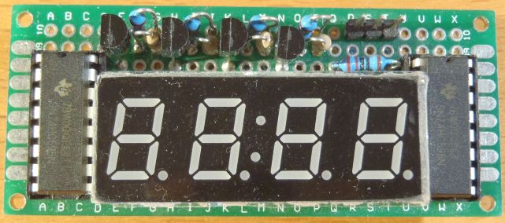

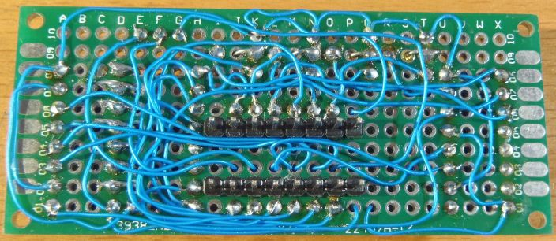

The configuration of `Hc595Module` is very similar to the 8-digit module, except
for the following:

* The LED module is a Common Anode, so the digit pin needs to be `HIGH` and
  the segment pin needs to be `LOW`.
* There are 4 driver transistors on the digit lines which allows it handle
  higher currents. These cause the logic levels on the digit lines to be
  inverted. The digits are activated by `LOW` not `HIGH`, so `DIGIT_ON_PATTERN`
  is set to `kActiveLowPattern`.
* The two 74HC595 chips are wired so that the digit lines are in the upper 8
  bits, and the segment lines are in the lower 8 bits. Thus `HC595_BYTE_ORDER`
  must be set to `kByteOrderDigitHighSegmentLow`.
* The `REMAP_ARRAY` can be set to `nullptr` because the digits are arranged in
  the natural ordering expected by `Hc595Module`, left-most digit at position 0,
  and the right-most digit at position 3.

Putting all these together, we get the following code which is similar to the
8-digit version above, except for a few configuration parameters (c.f.
[examples/Hc595Demo](examples/Hc595Demo)):

```C++
#include <Arduino.h>
#include <SPI.h> // SPIClass, SPI
#include <AceSPI.h>
#include <AceSegment.h>
using ace_spi::HardSpiInterface;
using ace_segment::Hc595Module;
using ace_segment::kByteOrderDigitHighSegmentLow;
using ace_segment::kActiveLowPattern;

const uint8_t NUM_DIGITS = 4;
const uint8_t FRAMES_PER_SECOND = 60;

const uint8_t SEGMENT_ON_PATTERN = kActiveLowPattern;
const uint8_t DIGIT_ON_PATTERN = kActiveLowPattern;
const uint8_t HC595_BYTE_ORDER = kByteOrderDigitHighSegmentLow;
const uint8_t* const REMAP_ARRAY = nullptr;

const uint8_t LATCH_PIN = 10;
const uint8_t DATA_PIN = MOSI;
const uint8_t CLOCK_PIN = SCK;

using SpiInterface = HardSpiInterface<SPIClass>;
SpiInterface spiInterface(SPI, LATCH_PIN);

Hc595Module<SpiInterface, NUM_DIGITS> ledModule(
    spiInterface,
    SEGMENT_ON_PATTERN,
    DIGIT_ON_PATTERN,
    FRAMES_PER_SECOND,
    HC595_BYTE_ORDER,
    REMAP_ARRAY
);

void setupAceSegment() {
  SPI.begin();
  spiInterface.begin();
  ledModule.begin();
}

// Flush to LED module when ready. Call this as fast as possible, allowing
// the internal counters to figure out when to actually render.
void flushModule() {
  ledModule.renderFieldWhenReady();
}

void setup() {
  setupAceSegment();
  ...
}

void loop() {
  flushModule();
  ...
}
```

<a name="RenderingHc595Module"></a>
#### Rendering the Hc595Module

Unlike the TM1637 and the MAX7219 chips, the 74HC595 does not automatically
multiplex through the digits of the LED module, giving the appearance that all
the digits are on at the same time. The scanning must be performed by the
microcontroller itself. The `Hc595Module::renderFieldWhenReady()` performs that
task. It should be called as quickly as possible, usually faster than `60 *
NUM_DIGITS` times per second, so for a 4-digit LED module, that's 240 times a
second, or every 5 milliseconds.

The rendering the LED module is split into 2 parts:

* a *frame* is one complete rendering of the LED display (4 digits),
* a *field* is a partial rendering of a single frame (usually a single digit).

A frame rate of about 60Hz will be sufficient to prevent obvious flickering of
the LED. For a 4-digit LED, that requires rendering 240 fields per second. The
`Hc595Module::renderFieldNow()` is meant to be used inside an interrupt service
routine (ISR) which is configured to execute exactly at the requested frequency.
It will immediately render the given field (a single digit) to the 74HC595 shift
registers. When it is called a second time, it will render the next digit. The
`Hc595Module::renderFieldWhenReady()` is designed to give an effective rendering
rate of 240 Hz using a polling method. It should be called as fast as possible
in the global `loop()` function. It keeps an internal timing variable that
remembers the last time that it was called. When the correct amount of time has
passed, it then calls `renderFieldNow()`, and resets the timing variable.

<a name="HybridModule"></a>
### HybridModule

Here is a 4-digit custom module that I built that uses one 74HC595 shift
register on the 8 segment lines (which can be accessed through 3 SPI pins), and
4 digit lines directly connected to the microcontroller.


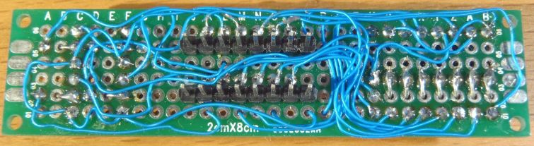

This particular module has the following characteristics:

* Common Cathode leds, which means that the digit must be `LOW` and the segment
  must be `HIGH`.
* But there are 4 driver transistors on the digit lines, which inverts the logic
  levels, so the digits need to be `HIGH`.

The `HybridModule` configuration looks like this (c.f.
[examples/HybridDemo](examples/HybridDemo)):

```C++
#include <Arduino.h>
#include <SPI.h> // SPIClass, SPI
#include <AceSPI.h>
#include <AceSegment.h>
using ace_spi::HardSpiInterface;
using ace_segment::HybridModule;
using ace_segment::kActiveHighPattern;

const uint8_t NUM_DIGITS = 4;
const uint8_t FRAMES_PER_SECOND = 60;

const uint8_t DIGIT_PINS[NUM_DIGITS] = {4, 5, 6, 7};
const uint8_t LATCH_PIN = 10;
const uint8_t DATA_PIN = MOSI;
const uint8_t CLOCK_PIN = SCK;

using SpiInterface = HardSpiInterface<SPIClass>;
SpiInterface spiInterface(SPI, LATCH_PIN);

HybridModule<SpiInterface, NUM_DIGITS> ledModule(
    spiInterface,
    kActiveHighPattern /*segmentOnPattern*/,
    kActiveHighPattern /*digitOnPattern*/,
    FRAMES_PER_SECOND,
    DIGIT_PINS
);

void setupAceSegment() {
  SPI.begin();
  spiInterface.begin();
  ledModule.begin();
}

// Flush to LED module when ready. Call this as fast as possible, allowing
// the internal counters to figure out when to actually render.
void flushModule() {
  ledModule.renderFieldWhenReady();
}

void setup() {
  setupAceSegment();
  ...
}

void loop() {
  flushModule();
  ...
}
```

<a name="DirectModule"></a>
### DirectModule

Here is a custom 4-digit module that whose digit and segment lines are connected
directly to the microcontroller without any driver chip. This requires a
microcontroller with at least 12 GPIO pins.

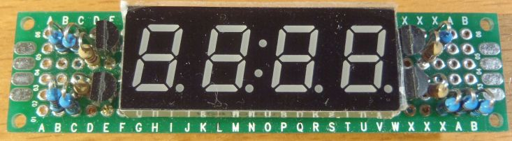

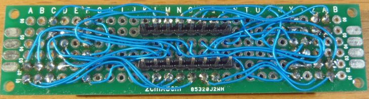

This particular module has the following characteristics:

* Common Anode leds, which means that the digit must be `HIGH` and the segment
  must be `LOW`.
* But there are 4 driver transistors on the digit lines, which inverts the logic
  levels, so the digits need to be `LOW`.

The `DirectModule` configuration looks like this (c.f.
[examples/DirectDemo](examples/DirectDemo)):

```C++
#include <Arduino.h>
#include <AceSegment.h>
using ace_segment::DirectModule;
using ace_segment::kActiveLowPattern;

const uint8_t NUM_DIGITS = 4;
const uint8_t NUM_SEGMENTS = 8;

const uint8_t DIGIT_PINS[NUM_DIGITS] = {4, 5, 6, 7};
const uint8_t SEGMENT_PINS[NUM_SEGMENTS] = {8, 9, 10, 16, 14, 18, 19, 15};

const uint8_t FRAMES_PER_SECOND = 60;

DirectModule<NUM_DIGITS, NUM_SUBFIELDS> ledModule(
    kActiveLowPattern /*segmentOnPattern*/,
    kActiveLowPattern /*digitOnPattern*/,
    FRAMES_PER_SECOND,
    SEGMENT_PINS,
    DIGIT_PINS);

void setupAceSegment() {
  ledModule.begin();
}

// Flush to LED module when ready. Call this as fast as possible, allowing
// the internal counters to figure out when to actually render.
void flushModule() {
  ledModule.renderFieldWhenReady();
}

void setup() {
  setupAceSegment();
  ...
}

void loop() {
  flushModule();
  ...
}
```

<a name="AdvancedUsage"></a>
## Advanced Usage

<a name="Tm1637CapacitorRemoval"></a>
### TM1637 Capacitor Removal

The black TM1637 LED modules from diymore.cc come with 10 nF filtering
capacitors on the `CLK` and `DIO` lines. This forces us to use a `BIT_DELAY` of
100 microseconds, which means that `flush()` on a 4-digit module takes 22
milliseconds. We can do far better by removing those filtering capacitors with a
soldering iron:

* See [docs/tm1637/capacitor_removal.md](docs/tm1637/capacitor_removal.md) for
  information on how to remove the 10 nF capacitors.

After removing them, I verified that these TM1637 LED modules will work with a
`BIT_DELAY` as low 1 microseconds (sometimes even a 0 microsecond delay will
work). The transmission time for `flush()` becomes proportionally faster. For
example, using 5 microsecond `BIT_DELAY` allows `flush()` to take only 1 to 2.3
milliseconds instead of 22 milliseconds.

<a name="DigitalWriteFast"></a>
### DigitalWriteFast on AVR Processors

On the AVR processors (e.g. Arduino Nano, SparkFun Pro Micro), the default
`digitalWrite()`, `digitalRead()` and `pinMode()` functions can be significantly
improved (up to 50X performance, and a lot less flash memory) if the pin number
and output value are known at compile-time. There are at least 2 libraries that
provide the `digitalWriteFast()` variants:

* https://github.com/watterott/Arduino-Libs/tree/master/digitalWriteFast, or
* https://github.com/NicksonYap/digitalWriteFast

I have written versions of some lower-level classes to take advantage of
`digitalWriteFast()`:

* `scanning/LedMatrixDirectFast4.h`
    * Variant of `LedMatrixDirect` using `digitalWriteFast()`
* AceSPI - `ace_api/SimpleSpiFastInterface.h`
    * Variant of `SimpleSpiInterface.h` using  `digitalWriteFast()` for the
      `MOSI`, `SCK` and `LATCH` pins
* AceSPI - `ace_spi/HardSpiFastInterface.h`
    * Variant of `HardSpiInterface.h` using  `digitalWriteFast()` to toggle
      the `LATCH` pin, while the hardware SPI code controls the `MOSI` and `SCK`
      pins
* AceTMI - `ace_spi/SimpleTmi1637FastInterface.h`
    * Variant of `SimpleTmi1637Interface.h` using `digitalWriteFast()`
* AceWire - `ace_wire/SimpleWireFastInterface.h`
    * Variant of `SimpleWireInterface.h` using `digitalWriteFast()`

Since these header files require an external `digitalWriteFast` library to be
installed, and they are only valid for AVR processors, these header files are
*not* included in the master `<AceSPI.h>`, `<AceTMI.h>` or `<AceWire.h` files.

If you want to use the fast version of `<AceSPI.h>`, you need to include these
headers manually, like this:

```C++
#include <AceSPI.h>
#if defined(ARDUINO_ARCH_AVR)
  #include <digitalWriteFast.h> // from 3rd party library
  #include <ace_spi/SimpleSpiFastInterface.h>
  #include <ace_spi/HardSpiFastInterface.h>
  using ace_spi::SimpleSpiFastInterface;
  using ace_spi::HardSpiFastInterface;
#endif
```

If you want to use the fast versions of `<AceTMI.h>`, use something like this:

```C++
#include <AceTMI.h>
#if defined(ARDUINO_ARCH_AVR)
  #include <ace_tmi/SimpleTmi1637FastInterface.h>
  using ace_tmi::SimpleTmi1637FastInterface;
#endif
```

If you want to use the fast versions of `<AceWire.h>`, use something like this:

```C++
#include <AceTMI.h>
#if defined(ARDUINO_ARCH_AVR)
  #include <ace_wire/SimpleWireFastInterface.h>
  using ace_wire::SimpleWireFastInterface;
#endif
```

The amount of flash memory saved can be between 100 to 700 bytes. This can make
meaningful differences on AVR processors, especially on the ATtiny85 with only
8kB of flash. See [MemoryBenchmark](examples/MemoryBenchmark) for full details.

<a name="MultipleSpiBuses"></a>
### Multiple SPI Buses

Some microcontrollers (e.g. STM32, ESP32) support multiple hardware SPI buses.
The AceSPI library (https://github.com/bxparks/AceSPI#MultipleSpiBuses) explains
how to configure these alternate hardware buses. Example can be found in
[examples/Max7219Demo](examples/Max7219Demo) and
[examples/Hc595Demo](examples/Hc595Demo).

With the software SPI classes in AceSPI (in other words, `SimpleSpiInterface`
and `SimpleSpiFastInterface`) you can use any alternative GPIO pins which are
suitable for SPI output.

<a name="ScanningModule"></a>
### Custom Configuration of ScanningModule

The 3 convenience classes (`DirectModule`, `HybridModule`, and `Hc595Module`)
are subclasses of the `ScanningModule` parent class. If you want to know how the
`ScanningModule` is implemented, there are some notes in
[docs/scanning_module.md](docs/scanning_module.md).

<a name="ResourceConsumption"></a>
## Resource Consumption

<a name="SizeOfClasses"></a>
### SizeOf Classes

Here are the sizes of the various classes on the 8-bit AVR microcontrollers
(Arduino Uno, Nano, etc):

```
sizeof(LedMatrixDirect<>): 9
sizeof(LedMatrixDirectFast4<6..13, 2..5>): 3
sizeof(LedMatrixSingleHc595<SimpleSpiInterface>): 9
sizeof(LedMatrixDualHc595<HardSpiInterface>): 9
sizeof(LedModule): 6
sizeof(ScanningModule<LedMatrixBase, 4>): 26
sizeof(DirectModule<4>): 35
sizeof(DirectFast4Module<...>): 29
sizeof(HybridModule<SimpleSpiInterface, 4>): 35
sizeof(Hc595Module<SimpleSpiInterface, 8>): 51
sizeof(Tm1637Module<SimpleTmi1637Interface, 4>): 17
sizeof(Tm1637Module<SimpleTmi1637Interface, 6>): 19
sizeof(Tm1638Module<SimpleTmi1638Interface, 8>): 21
sizeof(Tm1638AnodeModule<SimpleTmi1638Interface, 8>): 19
sizeof(Max7219Module<SimpleSpiInterface, 8>): 19
sizeof(Ht16k33Module<TwoWireInterface, 4>): 14
sizeof(Ht16k33Module<SimpleWireInterface, 4>): 17
```

On 32-bit processors, these numbers look like this:

```
sizeof(LedMatrixDirect<>): 16
sizeof(LedMatrixSingleHc595<SimpleSpiInterface>): 16
sizeof(LedMatrixDualHc595<HardSpiInterface>): 20
sizeof(LedModule): 8
sizeof(ScanningModule<LedMatrixBase, 4>): 32
sizeof(DirectModule<4>): 48
sizeof(HybridModule<SimpleSpiInterface, 4>): 48
sizeof(Hc595Module<SimpleSpiInterface, 8>): 64
sizeof(Tm1637Module<SimpleTmi1637Interface, 4>): 24
sizeof(Tm1637Module<SimpleTmi1637Interface, 6>): 24
sizeof(Tm1638Module<SimpleTmi1638Interface, 8>): 28
sizeof(Tm1638AnodeModule<SimpleTmi1638Interface, 8>): 24
sizeof(Max7219Module<SimpleSpiInterface, 8>): 24
sizeof(Ht16k33Module<TwoWireInterface, 4>): 20
sizeof(Ht16k33Module<SimpleWireInterface, 4>): 20
```

<a name="FlashAndStaticMemory"></a>
### Flash And Static Memory

For the most part, the user pays only for the feature that is being used. The
full details are given in [examples/MemoryBenchmark](examples/MemoryBenchmark).
Here are 2 samples of the flash and static memory consumptions.

**Arduino Nano (ATmega328)**

```
+--------------------------------------------------------------+
| functionality                   |  flash/  ram |       delta |
|---------------------------------+--------------+-------------|
| baseline                        |    456/   11 |     0/    0 |
|---------------------------------+--------------+-------------|
| DirectModule                    |   1548/   58 |  1092/   47 |
| DirectFast4Module               |   1304/   88 |   848/   77 |
|---------------------------------+--------------+-------------|
| Hybrid(HardSpi)                 |   1626/   56 |  1170/   45 |
| Hybrid(HardSpiFast)             |   1578/   54 |  1122/   43 |
| Hybrid(SimpleSpi)               |   1574/   53 |  1118/   42 |
| Hybrid(SimpleSpiFast)           |   1446/   48 |   990/   37 |
|---------------------------------+--------------+-------------|
| Hc595(HardSpi)                  |   1566/   55 |  1110/   44 |
| Hc595(HardSpiFast)              |   1542/   54 |  1086/   43 |
| Hc595(SimpleSpi)                |   1506/   53 |  1050/   42 |
| Hc595(SimpleSpiFast)            |   1110/   48 |   654/   37 |
|---------------------------------+--------------+-------------|
| Tm1637(SimpleTmi1637)           |   1422/   31 |   966/   20 |
| Tm1637(SimpleTmi1637Fast)       |    856/   26 |   400/   15 |
|---------------------------------+--------------+-------------|
| Tm1638(SimpleTmi1638)           |   1372/   32 |   916/   21 |
| Tm1638(SimpleTmi1638Fast)       |    842/   25 |   386/   14 |
| Tm1638Anode(SimpleTmi1638)      |   1368/   30 |   912/   19 |
| Tm1638Anode(SimpleTmi1638Fast)  |    838/   23 |   382/   12 |
|---------------------------------+--------------+-------------|
| Max7219(HardSpi)                |   1240/   39 |   784/   28 |
| Max7219(HardSpiFast)            |   1232/   37 |   776/   26 |
| Max7219(SimpleSpi)              |   1182/   37 |   726/   26 |
| Max7219(SimpleSpiFast)          |    764/   32 |   308/   21 |
|---------------------------------+--------------+-------------|
| Ht16k33(TwoWire)                |   2856/  243 |  2400/  232 |
| Ht16k33(SimpleWire)             |   1458/   33 |  1002/   22 |
| Ht16k33(SimpleWireFast)         |    926/   27 |   470/   16 |
+--------------------------------------------------------------+
```

**ESP8266**

```
+--------------------------------------------------------------+
| functionality                   |  flash/  ram |       delta |
|---------------------------------+--------------+-------------|
| baseline                        | 260089/27892 |     0/    0 |
|---------------------------------+--------------+-------------|
| DirectModule                    | 261537/28260 |  1448/  368 |
|---------------------------------+--------------+-------------|
| Hybrid(HardSpi)                 | 262681/28260 |  2592/  368 |
| Hybrid(SimpleSpi)               | 261625/28244 |  1536/  352 |
|---------------------------------+--------------+-------------|
| Hc595(HardSpi)                  | 262661/28272 |  2572/  380 |
| Hc595(SimpleSpi)                | 261509/28256 |  1420/  364 |
|---------------------------------+--------------+-------------|
| Tm1637(SimpleTmi1637)           | 261625/28224 |  1536/  332 |
|---------------------------------+--------------+-------------|
| Tm1638(SimpleTmi1638)           | 261529/28224 |  1440/  332 |
| Tm1638Anode(SimpleTmi1638)      | 261561/28224 |  1472/  332 |
|---------------------------------+--------------+-------------|
| Max7219(HardSpi)                | 262541/28240 |  2452/  348 |
| Max7219(SimpleSpi)              | 261389/28224 |  1300/  332 |
|---------------------------------+--------------+-------------|
| Ht16k33(TwoWire)                | 264381/28592 |  4292/  700 |
| Ht16k33(SimpleWire)             | 261705/28224 |  1616/  332 |
+--------------------------------------------------------------+
```

<a name="CpuCycles"></a>
### CPU Cycles

The CPU benchmark numbers can be seen in
[examples/AutoBenchmark](examples/AutoBenchmark). Here are 2 samples. All
timing numbers are in units of microseconds.

**Arduino Nano (ATmega328)**

```
+-----------------------------------------------+-------------------+---------+
| Functionality                                 |   min/  avg/  max | samples |
|-----------------------------------------------+-------------------+---------|
| Direct(4)                                     |    80/   83/   88 |      40 |
| Direct(4,subfields)                           |     4/   14/   84 |     640 |
| DirectFast4(4)                                |    28/   30/   44 |      40 |
| DirectFast4(4,subfields)                      |     4/    9/   40 |     640 |
|-----------------------------------------------+-------------------+---------|
| Hybrid(4,HardSpi)                             |    36/   42/   52 |      40 |
| Hybrid(4,HardSpi,subfields)                   |     4/    9/   48 |     640 |
| Hybrid(4,HardSpiFast)                         |    20/   27/   32 |      40 |
| Hybrid(4,HardSpiFast,subfields)               |     4/    8/   32 |     640 |
| Hybrid(4,SimpleSpi)                           |   156/  162/  180 |      40 |
| Hybrid(4,SimpleSpi,subfields)                 |     4/   23/  184 |     640 |
| Hybrid(4,SimpleSpiFast)                       |    28/   32/   40 |      40 |
| Hybrid(4,SimpleSpiFast,subfields)             |     4/    9/   44 |     640 |
|-----------------------------------------------+-------------------+---------|
| Hc595(8,HardSpi)                              |    28/   31/   40 |      80 |
| Hc595(8,HardSpi,subfields)                    |     4/    9/   44 |    1280 |
| Hc595(8,HardSpiFast)                          |    16/   19/   28 |      80 |
| Hc595(8,HardSpiFast,subfields)                |     4/    7/   28 |    1280 |
| Hc595(8,SimpleSpi)                            |   268/  274/  308 |      80 |
| Hc595(8,SimpleSpi,subfields)                  |     4/   37/  304 |    1280 |
| Hc595(8,SimpleSpiFast)                        |    24/   28/   40 |      80 |
| Hc595(8,SimpleSpiFast,subfields)              |     4/    9/   36 |    1280 |
|-----------------------------------------------+-------------------+---------|
| Tm1637(4,SimpleTmi1637,100us)                 | 22312/22343/22576 |      10 |
| Tm1637(4,SimpleTmi1637,100us,incremental)     |  3612/ 8808/10388 |      50 |
| Tm1637(4,SimpleTmi1637Fast,100us)             | 21064/21101/21400 |      10 |
| Tm1637(4,SimpleTmi1637Fast,100us,incremental) |  3412/ 8316/ 9848 |      50 |
|-----------------------------------------------+-------------------+---------|
| Tm1637(4,SimpleTmi1637,5us)                   |  2248/ 2286/ 2480 |      10 |
| Tm1637(4,SimpleTmi1637,5us,incremental)       |   368/  894/ 1128 |      50 |
| Tm1637(4,SimpleTmi1637Fast,5us)               |  1000/ 1034/ 1104 |      10 |
| Tm1637(4,SimpleTmi1637Fast,5us,incremental)   |   164/  402/  504 |      50 |
|-----------------------------------------------+-------------------+---------|
| Tm1638(8,SimpleTmi1638,1us)                   |  2940/ 2980/ 3244 |      10 |
| Tm1638(8,SimpleTmi1638Fast,1us)               |   316/  345/  364 |      10 |
| Tm1638Anode(8,SimpleTmi1638,1us)              |  2972/ 3004/ 3252 |      10 |
| Tm1638Anode(8,SimpleTmi1638Fast,1us)          |   352/  381/  396 |      10 |
|-----------------------------------------------+-------------------+---------|
| Max7219(8,HardSpi)                            |   220/  236/  252 |      20 |
| Max7219(8,HardSpiFast)                        |    96/  108/  120 |      20 |
| Max7219(8,SimpleSpi)                          |  2384/ 2392/ 2520 |      20 |
| Max7219(8,SimpleSpiFast)                      |   204/  216/  236 |      20 |
|-----------------------------------------------+-------------------+---------|
| Ht16k33(4,TwoWire,100kHz)                     |  1460/ 1463/ 1488 |      20 |
| Ht16k33(4,TwoWire,400kHz)                     |   500/  506/  528 |      20 |
| Ht16k33(4,SimpleWire,1us)                     |  2544/ 2557/ 2696 |      20 |
| Ht16k33(4,SimpleWireFast,1us)                 |   228/  238/  260 |      20 |
+-----------------------------------------------+-------------------+---------+
```

What is amazing is that if you use `digitalWriteFast()`, the software SPI is
just as fast as hardware SPI, **and** consumes 500 bytes of less flash memory.

**ESP8266**

```
+-----------------------------------------------+-------------------+---------+
| Functionality                                 |   min/  avg/  max | samples |
|-----------------------------------------------+-------------------+---------|
| Direct(4)                                     |    18/   19/   42 |      40 |
| Direct(4,subfields)                           |     0/    2/   34 |     640 |
|-----------------------------------------------+-------------------+---------|
| Hybrid(4,HardSpi)                             |    14/   15/   33 |      40 |
| Hybrid(4,HardSpi,subfields)                   |     0/    2/   31 |     640 |
| Hybrid(4,SimpleSpi)                           |    47/   47/   63 |      40 |
| Hybrid(4,SimpleSpi,subfields)                 |     0/    6/   63 |     640 |
|-----------------------------------------------+-------------------+---------|
| Hc595(8,HardSpi)                              |    15/   15/   35 |      80 |
| Hc595(8,HardSpi,subfields)                    |     0/    2/   35 |    1280 |
| Hc595(8,SimpleSpi)                            |    82/   82/   99 |      80 |
| Hc595(8,SimpleSpi,subfields)                  |     0/   10/  102 |    1280 |
|-----------------------------------------------+-------------------+---------|
| Tm1637(4,SimpleTmi1637,100us)                 | 21468/21472/21508 |      10 |
| Tm1637(4,SimpleTmi1637,100us,incremental)     |  3476/ 8466/ 9736 |      50 |
|-----------------------------------------------+-------------------+---------|
| Tm1637(4,SimpleTmi1637,5us)                   |  1497/ 1497/ 1501 |      10 |
| Tm1637(4,SimpleTmi1637,5us,incremental)       |   243/  591/  681 |      50 |
|-----------------------------------------------+-------------------+---------|
| Tm1638(8,SimpleTmi1638,1us)                   |  1582/ 1586/ 1622 |      10 |
| Tm1638Anode(8,SimpleTmi1638,1us)              |  1589/ 1591/ 1606 |      10 |
|-----------------------------------------------+-------------------+---------|
| Max7219(8,HardSpi)                            |   138/  138/  150 |      20 |
| Max7219(8,SimpleSpi)                          |   746/  746/  754 |      20 |
|-----------------------------------------------+-------------------+---------|
| Ht16k33(4,TwoWire,100kHz)                     |  1724/ 1725/ 1747 |      20 |
| Ht16k33(4,TwoWire,400kHz)                     |   359/  359/  363 |      20 |
| Ht16k33(4,SimpleWire,1us)                     |  1270/ 1271/ 1287 |      20 |
+-----------------------------------------------+-------------------+---------+
```

On the ESP8266, the hardware SPI is about 4X faster, but it does consume 1200
bytes for flash space. But on the ESP8266 flash memory is usually not a concern,
so it seems to make sense to use hardware SPI on the ESP8266.

<a name="SystemRequirements"></a>
## System Requirements

<a name="Hardware"></a>
### Hardware

**Tier 1: Fully Supported**

These boards are tested on each release:

* Arduino Nano (16 MHz ATmega328P)
* SparkFun Pro Micro (16 MHz ATmega32U4)
* STM32 Blue Pill (STM32F103C8, 72 MHz ARM Cortex-M3)
* NodeMCU 1.0 (ESP-12E module, 80MHz ESP8266)
* WeMos D1 Mini (ESP-12E module, 80 MHz ESP8266)
* ESP32 dev board (ESP-WROOM-32 module, 240 MHz dual core Tensilica LX6)
* Teensy 3.2 (72 MHz ARM Cortex-M4)

**Tier 2: Should work**

These boards should work but I don't test them as often:

* ATtiny85 (8 MHz ATtiny85)
* Arduino Pro Mini (16 MHz ATmega328P)
* Mini Mega 2560 (Arduino Mega 2560 compatible, 16 MHz ATmega2560)
* Teensy LC (48 MHz ARM Cortex-M0+)

**Tier 3: May work, but not supported**

* SAMD21 M0 Mini (48 MHz ARM Cortex-M0+)
    * Arduino-branded SAMD21 boards use the ArduinoCore-API, so are explicitly
      blacklisted. See below.
    * Other 3rd party SAMD21 boards *may* work using the SparkFun SAMD core.
    * However, as of SparkFun SAMD Core v1.8.6 and Arduino IDE 1.8.19, I can no
      longer upload binaries to these 3rd party boards due to errors.
    * Therefore, third party SAMD21 boards are now in this new Tier 3 category.
    * This library may work on these boards, but I can no longer support them.

**Tier Blacklisted**

The following boards are *not* supported and are explicitly blacklisted to allow
the compiler to print useful error messages instead of hundreds of lines of
compiler errors:

* Any platform using the ArduinoCore-API
  (https://github.com/arduino/ArduinoCore-api).
    * For example, Nano Every, MKRZero, and Raspberry Pi Pico RP2040.

<a name="ToolChain"></a>
### Tool Chain

* [Arduino IDE 1.8.19](https://www.arduino.cc/en/Main/Software)
* [Arduino CLI 0.31.0](https://arduino.github.io/arduino-cli)
* [SpenceKonde ATTinyCore 1.5.2](https://github.com/SpenceKonde/ATTinyCore)
* [Arduino AVR Boards 1.8.5](https://github.com/arduino/ArduinoCore-avr)
* [Arduino SAMD Boards 1.8.9](https://github.com/arduino/ArduinoCore-samd)
* [SparkFun AVR Boards 1.1.13](https://github.com/sparkfun/Arduino_Boards)
* [SparkFun SAMD Boards 1.8.9](https://github.com/sparkfun/Arduino_Boards)
* [STM32duino 2.4.0](https://github.com/stm32duino/Arduino_Core_STM32)
* [ESP8266 Arduino 3.0.2](https://github.com/esp8266/Arduino)
* [ESP32 Arduino 2.0.7](https://github.com/espressif/arduino-esp32)
* [Teensyduino 1.57](https://www.pjrc.com/teensy/td_download.html)

This library is *not* compatible with:

* Any platform using the
  [ArduinoCore-API](https://github.com/arduino/ArduinoCore-api), for example:
    * [Arduino megaAVR](https://github.com/arduino/ArduinoCore-megaavr/)
    * [MegaCoreX](https://github.com/MCUdude/MegaCoreX)
    * [Arduino SAMD Boards >=1.8.10](https://github.com/arduino/ArduinoCore-samd)

It should work with [PlatformIO](https://platformio.org/) but I have
not tested it.

The library can be compiled under Linux or MacOS (using both g++ and clang++
compilers) using the EpoxyDuino (https://github.com/bxparks/EpoxyDuino)
emulation layer.

<a name="OperatingSystem"></a>
### Operating System

I use Ubuntu 22.04 for the vast majority of my development. I expect that the
library will work fine under MacOS and Windows, but I have not explicitly tested
them.

<a name="BugsAndLimitations"></a>
## Bugs and Limitations

* This library does not currently support daisy-chaining of the MAX7219
  controller or the 74HC595 controller to create LED modules with more than 8
  digits.
* `Ht16k33Module`
    * The `Ht16k33Module` class does not support blinking the digits using
      the built-in hardware feature of the HT16K33 controller chip.
        * Should be relatively simple to add, but I have not done the work
          because I don't use this feature.
    * The HT16K33 chip supports up to 16 segments per digit, but AceSegment
      supports only 8 segments per digit.
* `Tm1638Module`
    * The TM1638 chip supports up to 10 segments per digit, but AceSegment
      supports only 8 segments per digit.
* Partial support for reading buttons through the key scanning functionality
  of some controller chips are available:
    * `Tm1638Module::readButtons()`
    * `Tm1637Module::readButtons()`
    * This functionality has not been extensively tested.

<a name="AlternativeLibraries"></a>
## Alternative Libraries

Here are some alternative seven-segment LED module libraries that I found on the
internet. I have looked at some briefly, but I have not used any of them, so I
cannot make any informed comments about them.

* TM1637 modules
    * https://github.com/avishorp/TM1637
    * https://github.com/jasonacox/TM1637TinyDisplay, fork of avishorp/TM1637
    * https://github.com/bremme/arduino-tm1637
    * https://github.com/maxint-rd/TM16xx
    * https://github.com/AKJ7/TM1637
* MAX7219 modules
    * https://github.com/wayoda/LedControl
    * https://github.com/ozhantr/DigitLedDisplay
* HT16K33 modules
    * https://github.com/RobTillaart/HT16K33
    * https://github.com/adafruit/Adafruit_LED_Backpack
    * https://github.com/jonpearse/ht16k33-arduino
    * https://github.com/rileyjshaw/Seg16
    * https://github.com/sparkfun/SparkFun_Alphanumeric_Display_Arduino_Library
* 74HC595 modules
    * https://github.com/MiguelPynto/ShiftDisplay
    * https://github.com/LuBossCzech/Led4digit74HC595
    * https://github.com/pseudoVella/shift7seg
    * https://github.com/crapp/sevseg
    * https://github.com/MiguelPynto/ShiftDisplay
    * https://github.com/ameer1234567890/ShiftDisplay2

<a name="License"></a>
## License

[MIT License](https://opensource.org/licenses/MIT)

<a name="FeedbackAndSupport"></a>
## Feedback and Support

If you have any questions, comments, or feature requests for this library,
please use the [GitHub
Discussions](https://github.com/bxparks/AceSegment/discussions) for this
project. If you have bug reports, please file a ticket in [GitHub
Issues](https://github.com/bxparks/AceSegment/issues). Feature requests should
go into Discussions first because they often have alternative solutions which
are useful to remain visible, instead of disappearing from the default view of
the Issue tracker after the ticket is closed.

Please refrain from emailing me directly unless the content is sensitive. The
problem with email is that I cannot reference the email conversation when other
people ask similar questions later.

<a name="Authors"></a>
## Authors

Created by Brian T. Park (brian@xparks.net).
