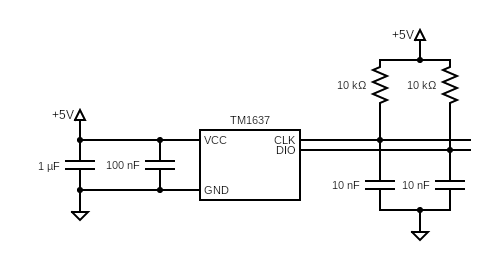
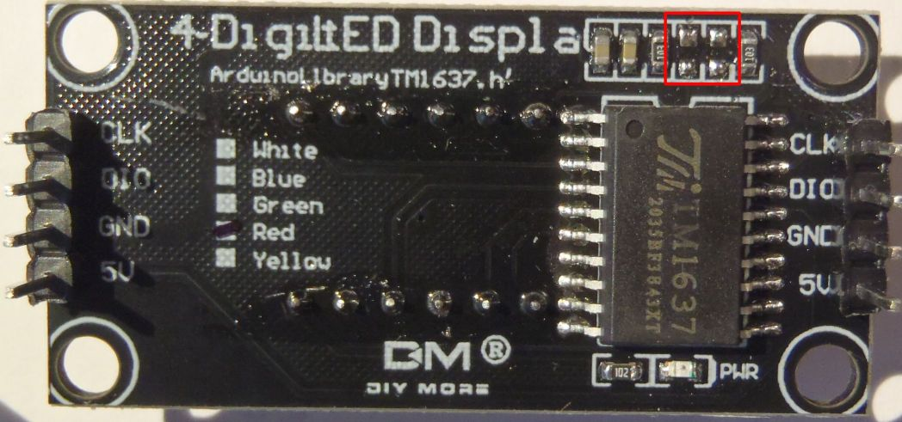
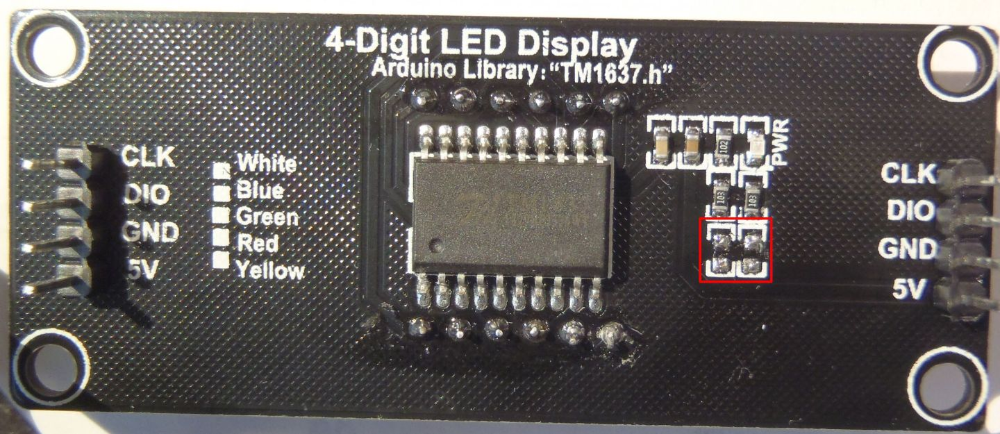
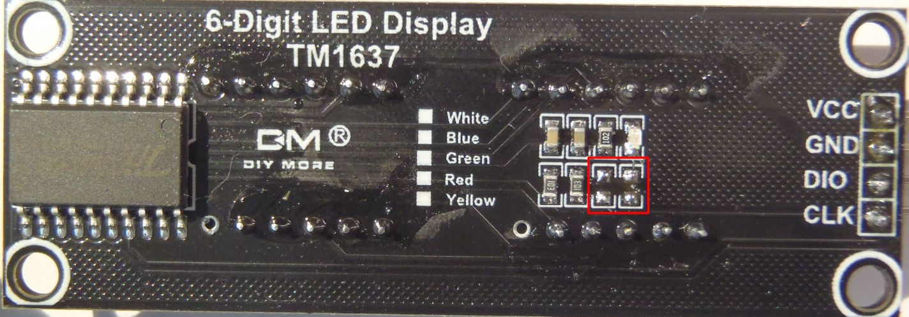
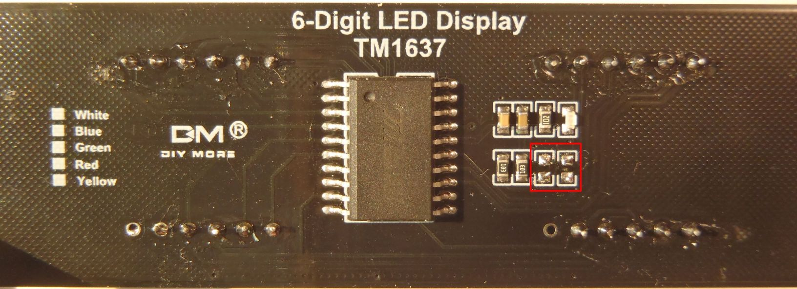

# TM1637 LED Module Capacitor Removal

There are at least two types of TM1637 LED modules which seem to be readily
available on Amazon and eBay currently.

* One type is labeled as being manufactured by diymore.cc and is available is 5
  different colors (white, red, yellow, green, and blue).  They manufactured on
  black printed circuit board, and come in 4-digit and 6-digit variations.
* Another type is a 4-digit a blue printed circuit board, but does not have any
  labels on it.

The LED modules from diymore.cc come with a 1 uF smoothing capacitor and a 0.1
uF filter capacitor across the `VCC` and `GND` lines. In addition, there are 2
noise rejection capacitors on the `DIO` and `CLK` pins to ground, as shown in
the schematic below:

The capacitors for `CLK` and `DIO` lines are 10 nF, which is about 50-100X
larger than they should be. It causes the RC time constant to be about 100
microseconds, which forces the `delayMicros` parameter in
`SimpleTmi1637Interface` and the `DELAY_MICROS` parameter in
`SimpleTmi1637FastInterface` to be 100 microseconds. According to the TM1637
datasheet, the controller chip has a maximum clock frequency of 500 kHz (50%
duty cycle), which implies a theoretical `DELAY_MICROS` of 1 microsecond.

The actual minimum value for the `delayMicroseconds()` function might be as low
as 0 for several reasons:

* there is overhead in calling the `delayMicroseconds()` function
* the implementation of the `delayMicroseconds()` function on AVR processors is
  not accurate for small (less than 10) microseconds
* there is overhead for the `digitalWrite()` or `digitalWriteFast()` functions
* there is overhead in the bit-shifting and looping

If you are handy with a soldering iron, you can remove the two 10 nF capacitors.
The capacitors are located in different places depending on the size of the LED
segments and the number of LED segments. The best way to identify the correct
capacitors is to use a multimeter and find the capacitors where one end of the
capacitor is connected to `GND` and the other end of the capacitor is connected
to either the `DIO` pin or the `CLK` pin.

In theory, these capacitors should be replaced with ones in the range of 100 to
500 pF , to prevent interference from high frequency noise on the `CLK` and
`DIO` lines. However, I have tested these modules with **no** capacitors on the
`DIO` and `CLK` lines, and was able to use a `delayMicros` or `DELAY_MICROS` as
low as 1 microsecond.

Here are the photos of the LED modules that I modified, where the red box marks
the place where the capacitors were removed:

## 4-digit 0.36" module

## 4-digit 0.56" module

## 6-digit 0.36" module

## 6-digit 0.56" module

